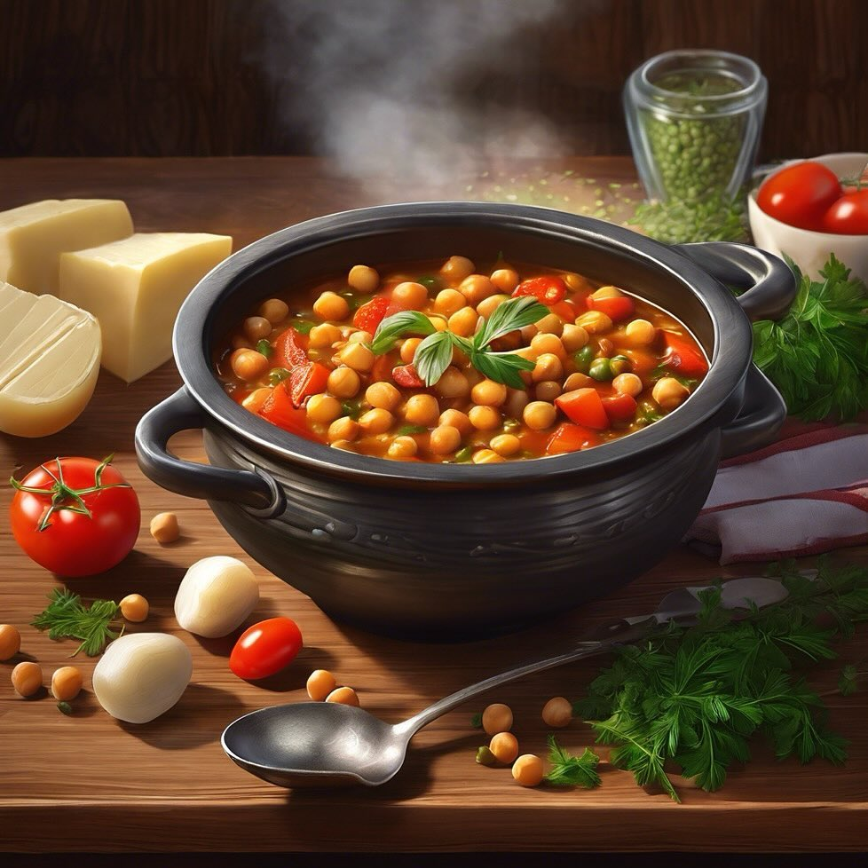

# Stufato di Ceci e Lenticchie **Ingredienti**: - 200 g di ceci - 200 g di lenticc

Stufato di Ceci e Lenticchie **Ingredienti**: - 200 g di ceci - 200 g di lenticchie - 2 patate - 2 carote - 1 cipolla - 400 g di pomodori pelati - 1 cucchiaino di curcuma - Sale e pepe q.b. **Preparazione**: 1. Soffriggi la cipolla in olio d’oliva, poi aggiungi le carote e le patate a cubetti. 2. Aggiungi i ceci, le lenticchie, i pomodori e la curcuma. 3. Copri con acqua, porta a ebollizione e cuoci per 40-50 minuti. 4. Aggiusta di sale e pepe. Stufato di Ceci e Lenticchie - **Varianti**: Prova ad aggiungere salsiccia vegetale o carne per rendere il piatto più sostanzioso. - **Consiglio**: Questo stufato è ottimo anche il giorno dopo, poiché i sapori si intensificano.

---

*Ricetta da @leguminando*
