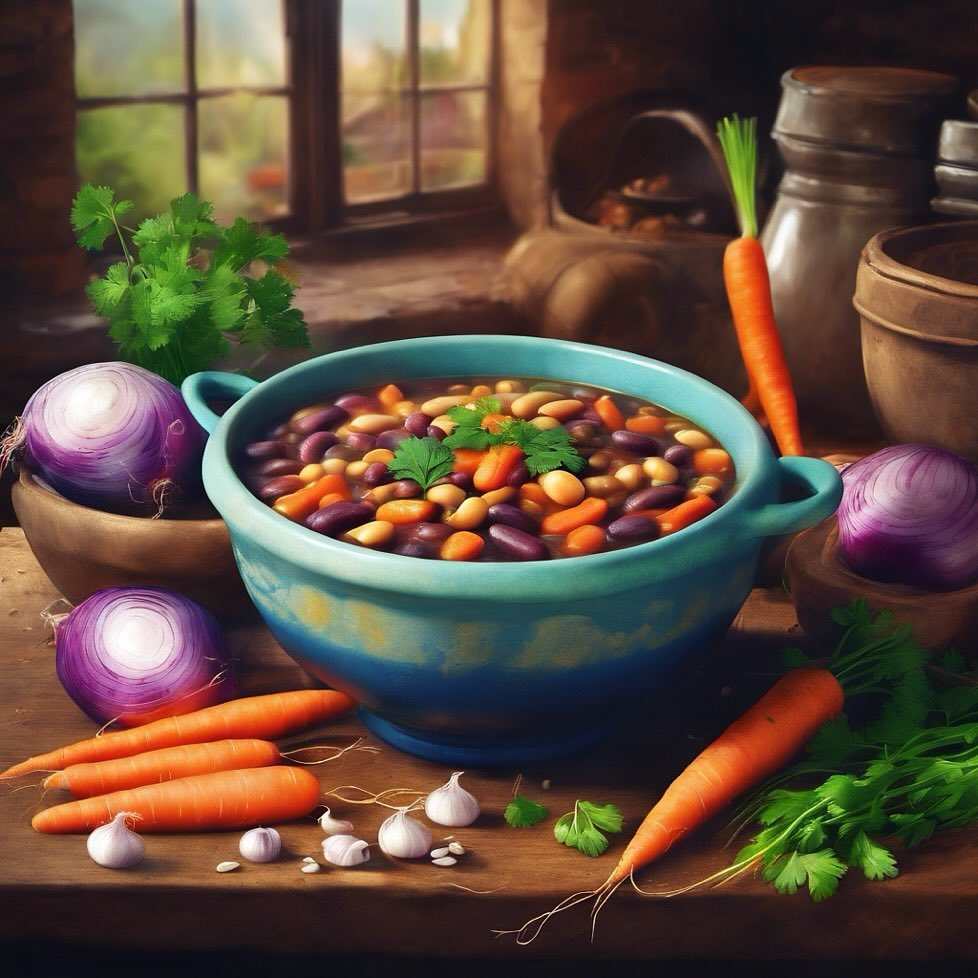

# Stufato di Fagioli Misti **Ingredienti:** - 300g di fagioli misti - 1 cipolla - 

Stufato di Fagioli Misti **Ingredienti:** - 300g di fagioli misti - 1 cipolla - 2 carote - 1 litro di brodo vegetale **Preparazione:** 1. **Soffritto:** In una pentola grande, scalda un filo d’olio e aggiungi la cipolla tritata. Fai soffriggere fino a quando è trasparente. 2. **Aggiunta delle verdure:** Aggiungi le carote tagliate a rondelle e cuoci per circa 5 minuti. 3. **Cottura dei fagioli:** Aggiungi i fagioli misti e il brodo vegetale. Porta a ebollizione e poi riduci il fuoco. Lascia cuocere a fuoco lento per circa 40 minuti. 4. **Servizio:** Una volta pronto, servi lo stufato caldo, accompagnato da pane fresco o crostini.

---

*Ricetta da @leguminando*
