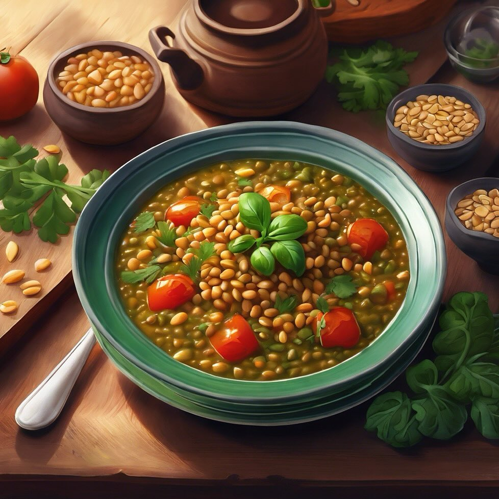

# **Stufato di Lenticchie e Cavolo Verde** - Ingredienti: lenticchie, cavolo verde

**Stufato di Lenticchie e Cavolo Verde** - Ingredienti: lenticchie, cavolo verde, pomodori pelati, cipolla, spezie, pinoli. - Preparazione: cuocere le lenticchie con la cipolla, aggiungere il cavolo e i pomodori. Servire con pinoli. **Stufato di Lenticchie e Cavolo Verde** - **Preparazione**: In una pentola, cuocere la cipolla tritata in olio d’oliva. Aggiungere le lenticchie sciacquate e il cavolo verde tagliato a strisce. Unire i pomodori pelati e spezie a piacere. Versare acqua o brodo e cuocere a fuoco lento fino a quando le lenticchie sono tenere. Servire con pinoli tostati.

---

*Ricetta da @leguminando*
