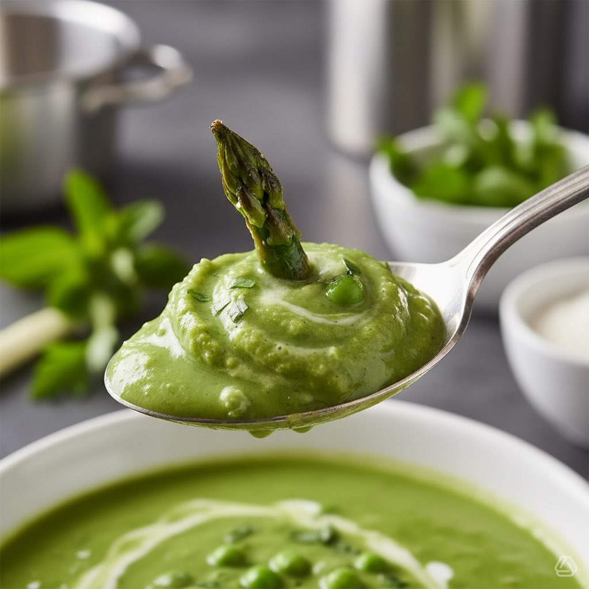

# **Vellutata di Fave con Asparagi Croccanti e Ravanelli in Agrodolce** **Ingredie

**Vellutata di Fave con Asparagi Croccanti e Ravanelli in Agrodolce** **Ingredienti per 4 persone:** - **Fave:** 500 g (sgranate e pelate) - **Asparagi:** 1 mazzo (circa 300 g) - **Ravanelli:** 6-8 - **Scalogno:** 1 medio - **Brodo vegetale:** 600 ml - **Panna:** 50 ml - **Aceto di mele:** 50 ml - **Zucchero:** 1 cucchiaino - **Olio extravergine d’oliva, sale, pepe, menta fresca:** q.b. **Procedimento:** 1. **Preparazione dei Ravanelli in Agrodolce:** - Affetta sottilmente i ravanelli. - Mescola aceto, zucchero e un pizzico di sale in un barattolo. - Immergi i ravanelli e lascia riposare in frigo per almeno 30 minuti. 2. **Preparazione della Base:** - Rosola lo scalogno tritato in una pentola con un filo d’olio. - Aggiungi le fave e cuoci per 2 minuti. 3. **Cottura:** - Copri le fave con il brodo vegetale. - Cuoci a fuoco medio per 15-20 minuti. 4. **Preparazione della Crema:** - Frulla il tutto con un mixer a immersione fino a ottenere una crema liscia. - Aggiungi la panna vegetale (o il latte di cocco) e aggiusta di sale e pepe. - Mantieni in caldo. 5. **Cottura degli Asparagi:** - Cuoci le punte degli asparagi in padella con un filo d’olio e sale per 4-5 minuti, finché non sono croccanti. 6. **Impiattamento:** - Versa la vellutata di fave in una ciotola. - Adagia al centro gli asparagi. - Decora con i ravanelli in agrodolce e foglie di menta fresca.

---

*Ricetta da @leguminando*
