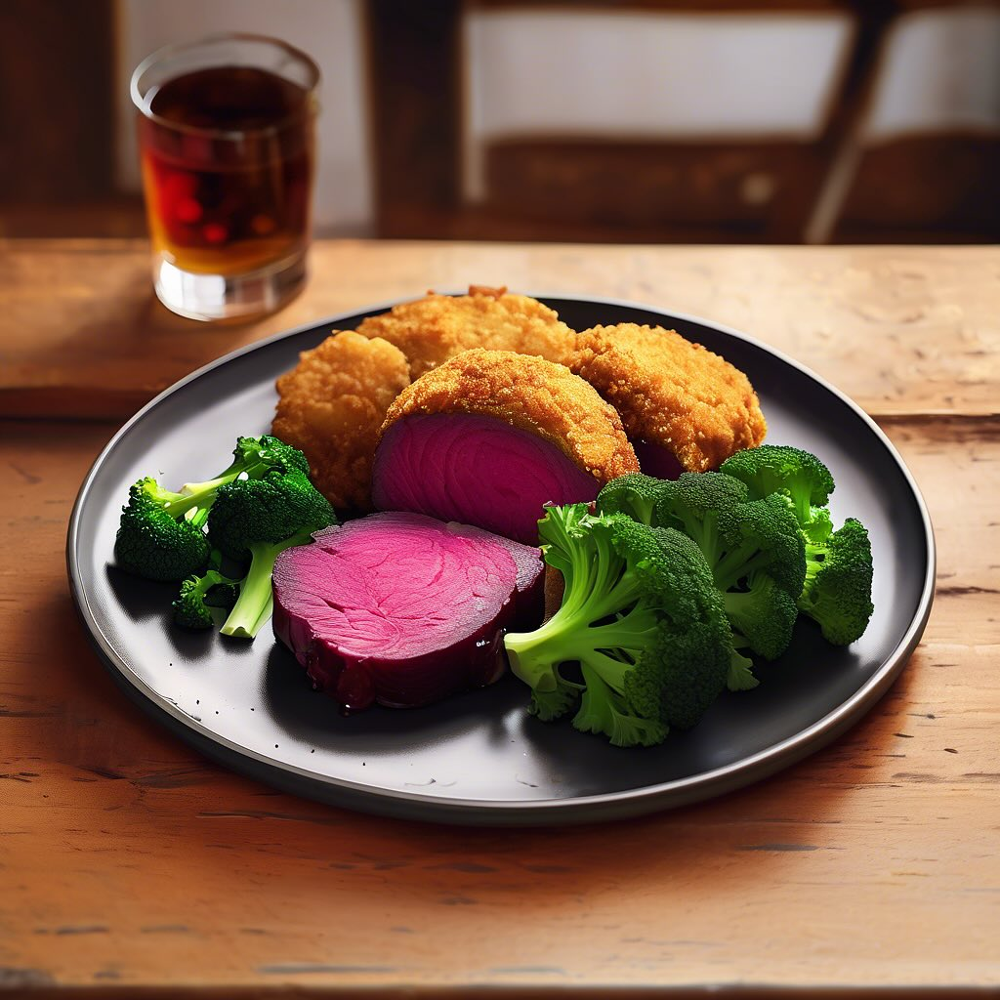

# ### Zuppa di Asparagi, Lenticchie Rosse e Cavolo Nero #### Ingredienti: - 200 g 

### Zuppa di Asparagi, Lenticchie Rosse e Cavolo Nero #### Ingredienti: - 200 g di asparagi freschi - 150 g di lenticchie rosse - 150 g di cavolo nero - 2 spicchi d’aglio - 1 cipolla media - 1 litro di brodo vegetale - 3 cucchiai di olio d’oliva - Sale e pepe q.b. - Succo di limone (facoltativo) - Peperoncino fresco o in polvere (facoltativo, per un tocco piccante) #### Procedimento: 1. **Preparazione degli Ingredienti**: Lava gli asparagi, rimuovi le estremità legnose e tagliali a pezzi di circa 3 cm. Lava il cavolo nero, rimuovi le coste dure e taglialo a strisce. Sminuzza la cipolla e schiaccia gli spicchi d’aglio. 2. **Soffritto**: In una pentola capiente, scalda l’olio d’oliva a fuoco medio. Aggiungi la cipolla e l’aglio, e soffriggi fino a quando la cipolla diventa traslucida. 3. **Cottura delle Lenticchie**: Aggiungi le lenticchie rosse nella pentola e mescola per un paio di minuti. Versare il brodo vegetale e portare a ebollizione. Riduci il fuoco e lascia cuocere per circa 10 minuti, finché le lenticchie non iniziano a diventare tenere. 4. **Aggiunta degli Asparagi e Cavolo Nero**: Aggiungi gli asparagi e il cavolo nero nella pentola. Continua a cuocere per altri 5-7 minuti, fino a quando gli asparagi sono teneri e il cavolo è appassito. 5. **Condimento**: Aggiusta di sale e pepe a piacere. Se desideri, aggiungi un po’ di succo di limone e peperoncino per un tocco extra di sapore. 6. **Servizio**: Servi la zuppa calda, magari con una fetta di pane croccante a lato.

---

*Ricetta da @leguminando*
