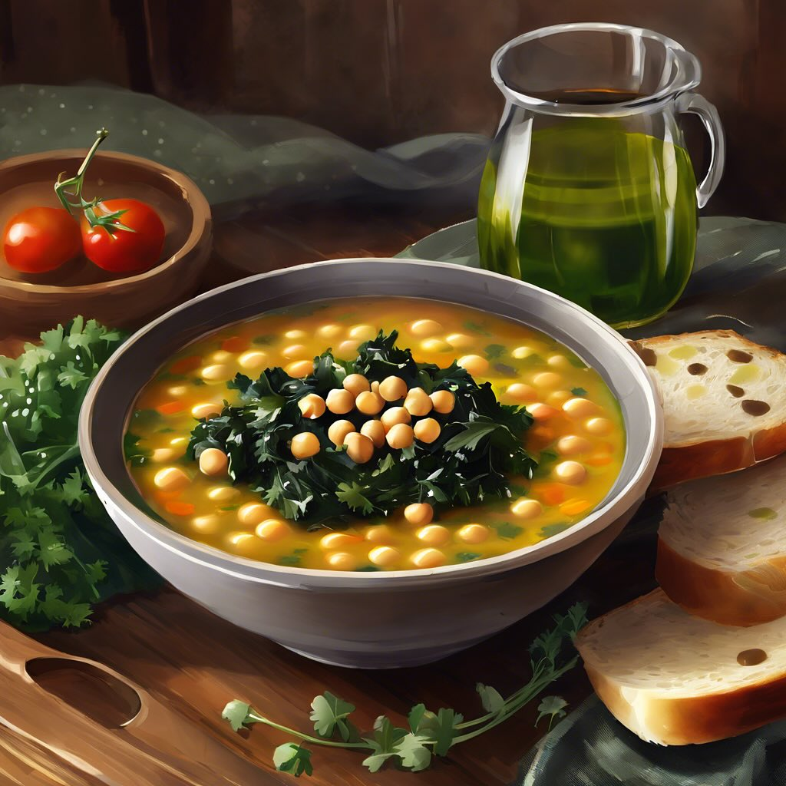

# ### Zuppa di Cavolo Nero e Cicerchie #### Ingredienti: - 200 g di cicerchie - 30

### Zuppa di Cavolo Nero e Cicerchie #### Ingredienti: - 200 g di cicerchie - 300 g di cavolo nero - 1 cipolla - 2 spicchi d’aglio - 4 cucchiai di olio d’oliva - 1 litro di brodo vegetale - 1 pomodoro maturo (o 200 g di pomodori pelati) - Sale e pepe q.b. - Rosmarino fresco (o altre erbe aromatiche a piacere) - Pane tostato per servire #### Procedimento: 1. **Preparazione delle cicerchie**: Metti le cicerchie in ammollo per almeno 8 ore. Scolale e cuocile in acqua salata per circa 1 ora, finché non sono tenere. Se usi cicerchie in scatola, scolale e risciacquale. 2. **Preparazione del cavolo nero**: Lava bene le foglie di cavolo nero, rimuovi le coste più dure e tagliale a strisce. 3. **Soffritto**: In una pentola capiente, scalda l’olio d’oliva a fuoco medio. Aggiungi la cipolla tritata e l’aglio schiacciato, e fai soffriggere fino a quando la cipolla diventa trasparente. 4. **Aggiungere il pomodoro**: Unisci il pomodoro tagliato a cubetti (o i pomodori pelati) al soffritto e cuoci per qualche minuto, mescolando. 5. **Cottura del cavolo**: Aggiungi il cavolo nero nella pentola e mescola bene. Cuoci per circa 5 minuti, fino a quando il cavolo inizia a appassire. 6. **Unire le cicerchie**: Aggiungi le cicerchie cotte e il brodo vegetale. Porta a ebollizione e poi riduci il fuoco, lasciando sobbollire per circa 15-20 minuti. Aggiusta di sale e pepe. 7. **Servire**: Una volta che la zuppa è ben amalgamata e saporita, servila calda con un filo d’olio d’oliva a crudo e fette di pane tostato. ### Consigli: - Puoi personalizzare questa zuppa aggiungendo altre verdure, come carote o sedano, per un sapore ancora più ricco. - Se ti piace, puoi aggiungere un pizzico di peperoncino per un tocco piccante.

---

*Ricetta da @leguminando*
