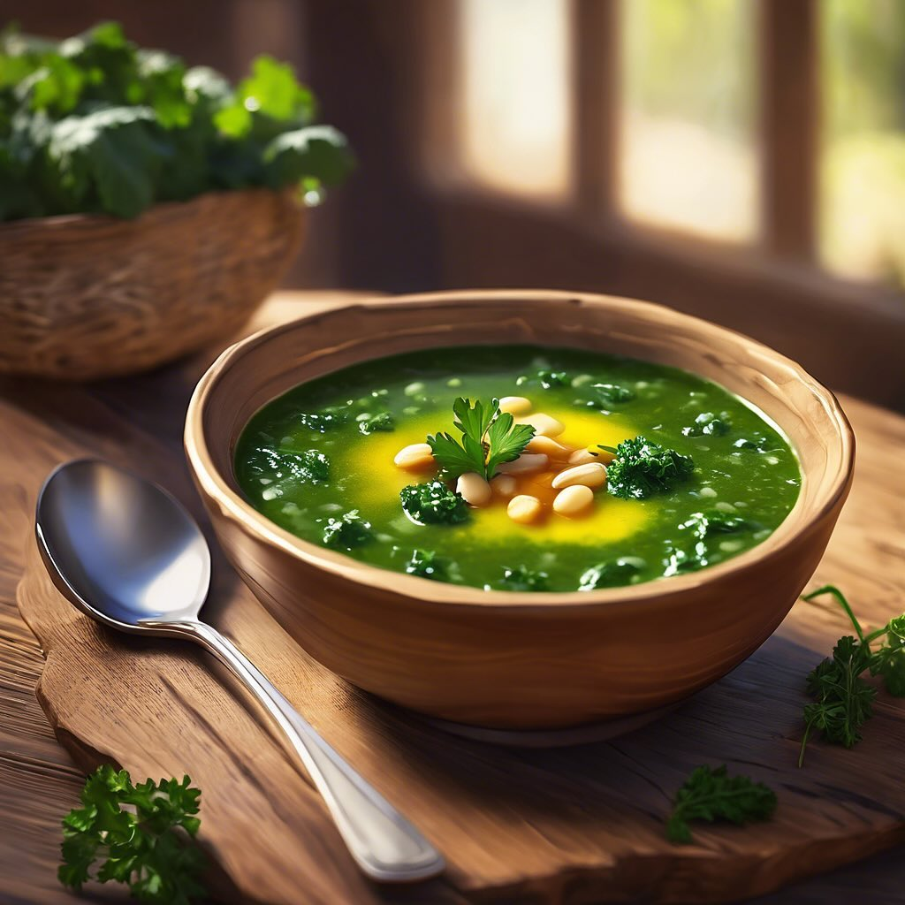

# ## Zuppa di Cavolo Nero e Fagioli Cannellini #### Ingredienti: - 200 g di fagiol

## Zuppa di Cavolo Nero e Fagioli Cannellini #### Ingredienti: - 200 g di fagioli cannellini (in scatola o lessati) - 200 g di cavolo nero, lavato e tagliato a strisce - 1 cipolla, tritata finemente - 2 spicchi d’aglio, tritati - 2 carote, tagliate a cubetti - 1 gambo di sedano, tagliato a cubetti - 1 litro di brodo vegetale - 2 cucchiai di olio extravergine d’oliva - 1 rametto di rosmarino (opzionale) - Sale e pepe q.b. - Peperoncino (opzionale, per un tocco piccante) - Pane croccante per servire #### Procedimento: 1. **Soffritto**: In una pentola capiente, scalda l’olio extravergine d’oliva a fuoco medio. Aggiungi la cipolla, l’aglio, le carote e il sedano. Soffriggi per circa 5-7 minuti, finché le verdure non si ammorbidiscono. 2. **Aggiungi il cavolo**: Unisci il cavolo nero e il rosmarino (se lo usi) e cuoci per altri 5 minuti, mescolando di tanto in tanto. 3. **Brodo e fagioli**: Versa il brodo vegetale nella pentola e porta a ebollizione. Aggiungi i fagioli cannellini e cuoci a fuoco lento per 20-25 minuti. Se desideri una zuppa più cremosa, puoi schiacciare un po’ di fagioli con una forchetta. 4. **Condimento**: Aggiusta di sale, pepe e peperoncino a piacere. 5. **Servizio**: Servi la zuppa calda con un filo d’olio extravergine d’oliva e fette di pane croccante.

---

*Ricetta da @leguminando*
