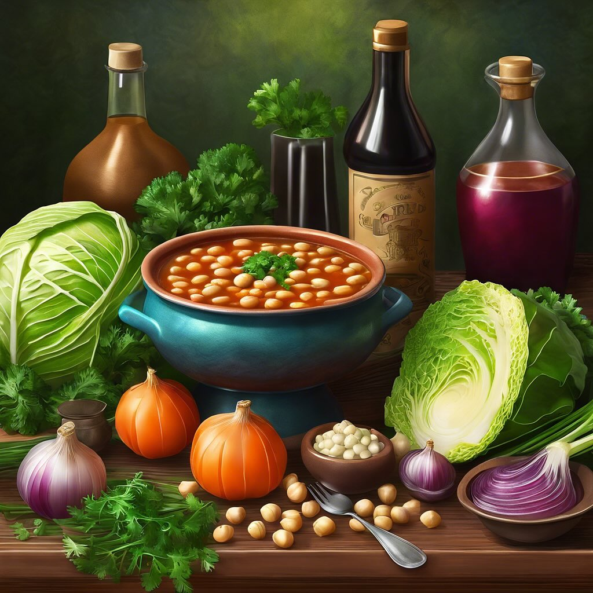

# ### Zuppa di Cavolo Verza, Fagioli Borlotti e Ceci #### Ingredienti: - 200 g di 

### Zuppa di Cavolo Verza, Fagioli Borlotti e Ceci #### Ingredienti: - 200 g di cavolo verza - 200 g di fagioli borlotti (cotti, se in scatola sciacquati) - 200 g di ceci (cotti, se in scatola sciacquati) - 1 cipolla grande - 2 carote - 2 spicchi d’aglio - 1 litro di brodo vegetale - 3 cucchiai di olio d’oliva - Sale e pepe q.b. - Peperoncino (facoltativo) - Prezzemolo fresco per guarnire #### Procedimento: 1. **Preparazione degli ingredienti**: Lava e taglia a strisce il cavolo verza. Sbuccia e affetta finemente la cipolla e le carote. Schiaccia gli spicchi d’aglio. 2. **Soffritto**: In una pentola capiente, scalda l’olio d’oliva a fuoco medio. Aggiungi la cipolla e l’aglio, e soffriggi fino a quando la cipolla diventa trasparente. 3. **Aggiunta delle verdure**: Unisci le carote e il cavolo verza nella pentola. Mescola e lascia cuocere per circa 5-7 minuti, fino a quando le verdure iniziano ad ammorbidirsi. 4. **Brodo e legumi**: Versa il brodo vegetale nella pentola e porta a ebollizione. Aggiungi i fagioli borlotti e i ceci. Se desideri, aggiungi un pizzico di peperoncino per un tocco piccante. 5. **Cottura**: Riduci il fuoco e lascia sobbollire la zuppa per circa 20-25 minuti, mescolando di tanto in tanto. Aggiusta di sale e pepe secondo il tuo gusto. 6. **Servizio**: Una volta pronta, servi la zuppa calda in ciotole, guarnita con prezzemolo fresco tritato.

---

*Ricetta da @leguminando*
