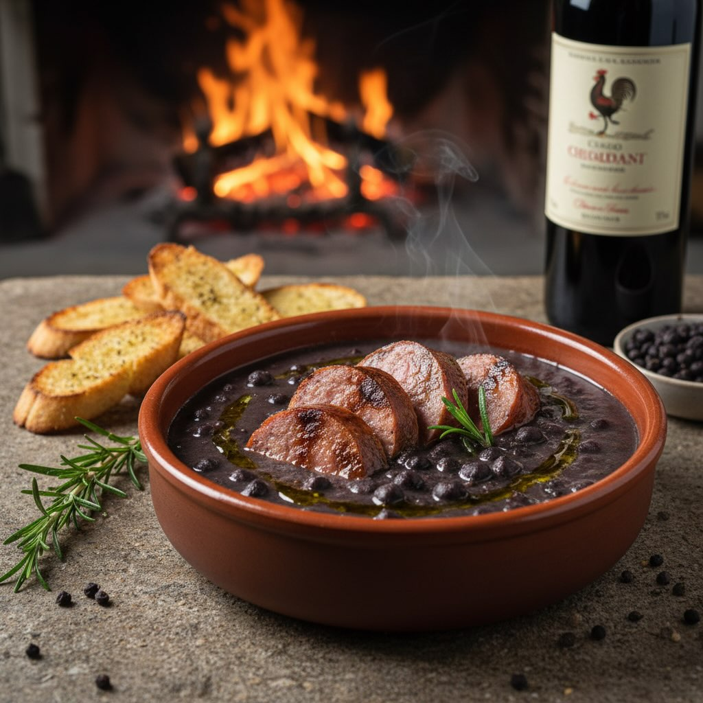

# ### Zuppa di Ceci Neri **Ingredienti:** - **Ceci Neri:** 300g ceci neri secchi (

### Zuppa di Ceci Neri **Ingredienti:** - **Ceci Neri:** 300g ceci neri secchi (tipici della Val d’Orcia o della Maremma) - **Passata di Pomodoro:** 400ml (preferibilmente San Marzano) - **Cipolla:** 1 cipolla bianca grossa - **Aglio:** 3 spicchi d’aglio rosso (o aglio fresco) - **Rosmarino:** 4 rametti di rosmarino fresco + altri per guarnire - **Peperoncino:** 1 peperoncino fresco (o fiocchi) - **Olio d’Oliva:** 4 cucchiai di olio extravergine d’oliva (preferibilmente olio novo toscano) - **Concentrato di Pomodoro:** 1 cucchiaio - **Vino Rosso:** 1 bicchiere (Chianti o Morellino) - **Brodo/Acqua:** 1 litro di brodo vegetale o acqua - **Sale e Pepe:** Sale q.b. e pepe nero macinato al momento ## Salsiccia **Ingredienti:** - **Salsicce:** 4 salsicce di Maremma (o salsicce di monte Amiata, almeno 80% carne) - **Legna:** Legna di ulivo o quercia per il camino (o brace se usi barbecue) Crostini **Ingredienti:** - **Pane:** 4 fette di pane sciocco toscano (o pane casereccio raffermo di 2-3 giorni) - **Aglio:** 2 spicchi - **Olio d&#039;Oli’a:** Olio extravergine d’oliva

---

*Ricetta da @leguminando*
