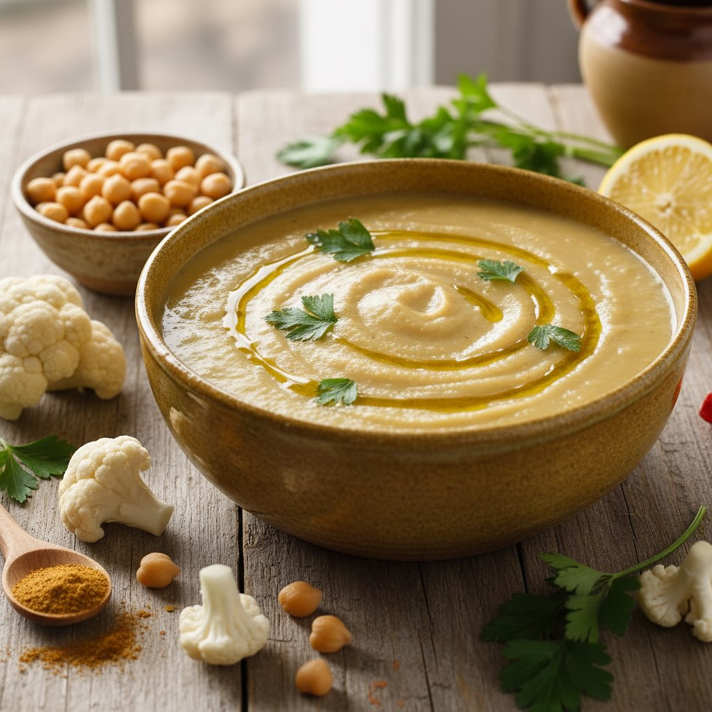

# Zuppa di cavolfiore e ceci alla curcuma Porzioni: 4 Tempo totale: 40–45 min Diff

Zuppa di cavolfiore e ceci alla curcuma Porzioni: 4 Tempo totale: 40–45 min Difficoltà: bassa Ingredienti - 1 testa di cavolfiore (circa 600 g), tagliata in cimette - 240 g di ceci cotti - 1 cipolla media, tritata finemente - 2 spicchi d’aglio, schiacciati - 1 cucchiaio di olio extravergine d’oliva - 750 ml di brodo vegetale (o acqua + dado) - 1 cucchiaino raso di curcuma in polvere - ½ cucchiaino di cumino in polvere - 1 cm di radice di zenzero fresco (o ¼ cucchiaino di zenzero secco), grattugiato - Sale e pepe nero q.b. - Succo di ½ limone - Una manciata di prezzemolo o coriandolo fresco tritato - (Opzionale) 2 cucchiai di panna da cucina o latte di cocco per una consistenza più cremosa Procedimento 1. Scalda l’olio in una pentola dai bordi alti a fuoco medio. Aggiungi cipolla e aglio e fai soffriggere 4–5 minuti, finché diventano morbidi e traslucidi. 2. Unisci curcuma, cumino e zenzero: mescola rapidamente per tostare le spezie (30 sec), poi versa un goccio di brodo per non farle attaccare. 3. Aggiungi le cimette di cavolfiore e i ceci scolati, mescola bene per ricoprire con le spezie. 4. Versa il brodo fino a coprire appena le verdure, porta a leggera ebollizione, poi abbassa la fiamma e lascia sobbollire 15–20 minuti, o finché il cavolfiore è tenero. 5. Regola di sale e pepe, quindi frulla il 50–70 % della zuppa con un frullatore a immersione (oppure trasferisci una parte in un mixer). Se ti piace molto liscia, frulla tutto. 6. Rimetti sul fuoco dolce: se vuoi una zuppa vellutata aggiungi la panna o il latte di cocco, mescola e scalda senza bollire. 7. Spegni, incorpora il succo di limone e mescola. Lascia riposare un paio di minuti prima di servire. Guarnizione e varianti • Decora con un filo d’olio a crudo, una spolverata extra di curcuma o cumino e il prezzemolo/coriandolo. • Per un tocco “speziato”: aggiungi ¼ di cucchiaino di peperoncino in polvere insieme agli altri aromi. • Se vuoi più proteine, servi con crostini integrali o pane alle noci. • Puoi sostituire parte del brodo con latte di mandorla non zuccherato per un sapore più dolce e cremoso.

---

*Ricetta da @leguminando*
