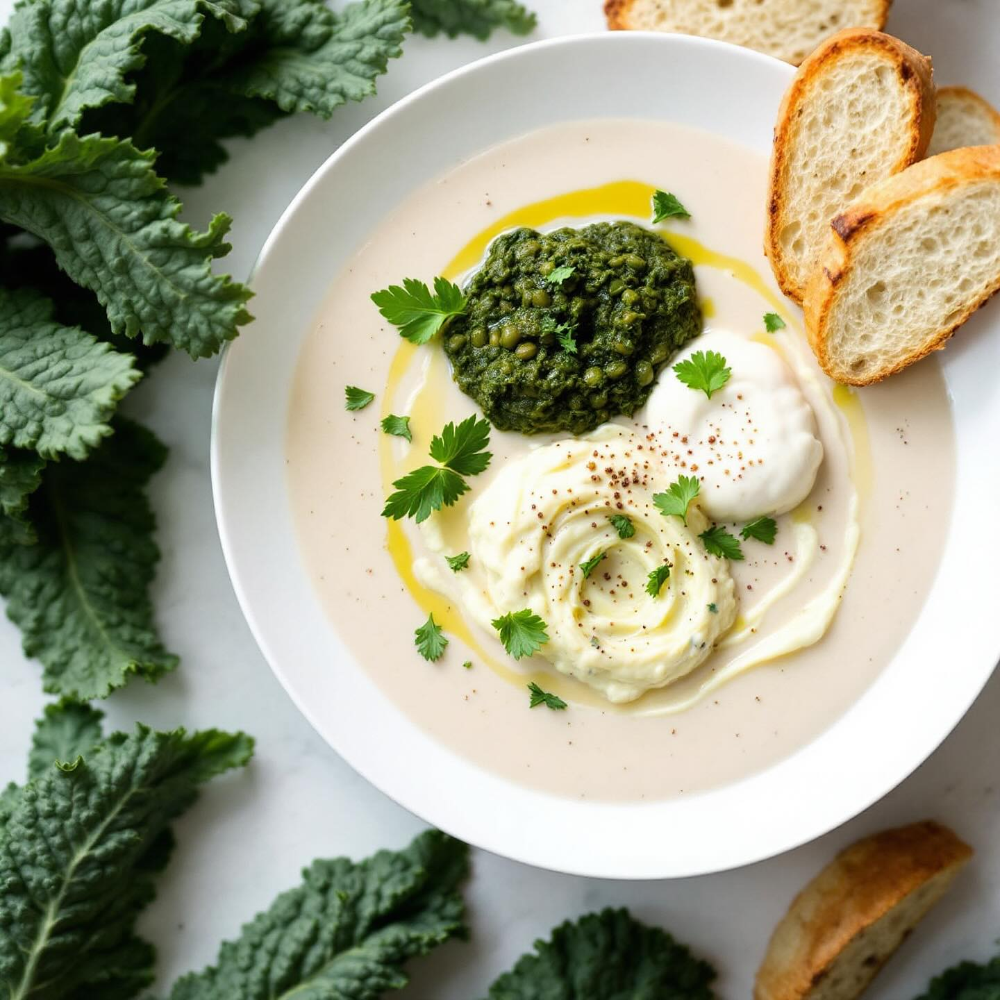

# Zuppa di fagioli dall’occhio con crema di cavoli Ingredienti in breve • Fagioli 

Zuppa di fagioli dall’occhio con crema di cavoli Ingredienti in breve • Fagioli dall’occhio (250 g secchi o metà secchi e metà in scatola) • Soffritto di cipolla, carota, sedano, aglio, olio EVO • Brodo vegetale (o semplice acqua) • Per la crema: cavolo nero, cavolfiore, cavolo cappuccio, patata, brodo, aglio, olio EVO Procedimento essenziale 1. Ammollo dei fagioli (8–12 h), poi bollitura in acqua/brodo fino a tenerezza (45–60 min). Sala solo a fine cottura. 2. In un’altra pentola, scalda olio, soffriggi cipolla, carota, sedano e aglio; unisci i fagioli cotti con parte del loro liquido, regola di sale, pepe e peperoncino. Lasciali insaporire 5 min. 3. Per la crema: in un tegamino scalda olio e aglio, aggiungi i cavoli e la patata, copri di brodo e cuoci 15–20 min. Frulla fino a crema omogenea, aggiusta di sale e pepe. 4. Impiatta la zuppa, decora con la crema di cavoli a arabeschi, un filo d’olio a crudo e crostini tostati. Varianti &amp; consigli • Erbe fresche (prezzemolo, timo limone) a crudo • Una dadolata di pancetta o guanciale nel soffritto per sapore extra • Sostituisci metà dei fagioli secchi con quelli in barattolo per risparmiare tempo.

---

*Ricetta da @leguminando*
