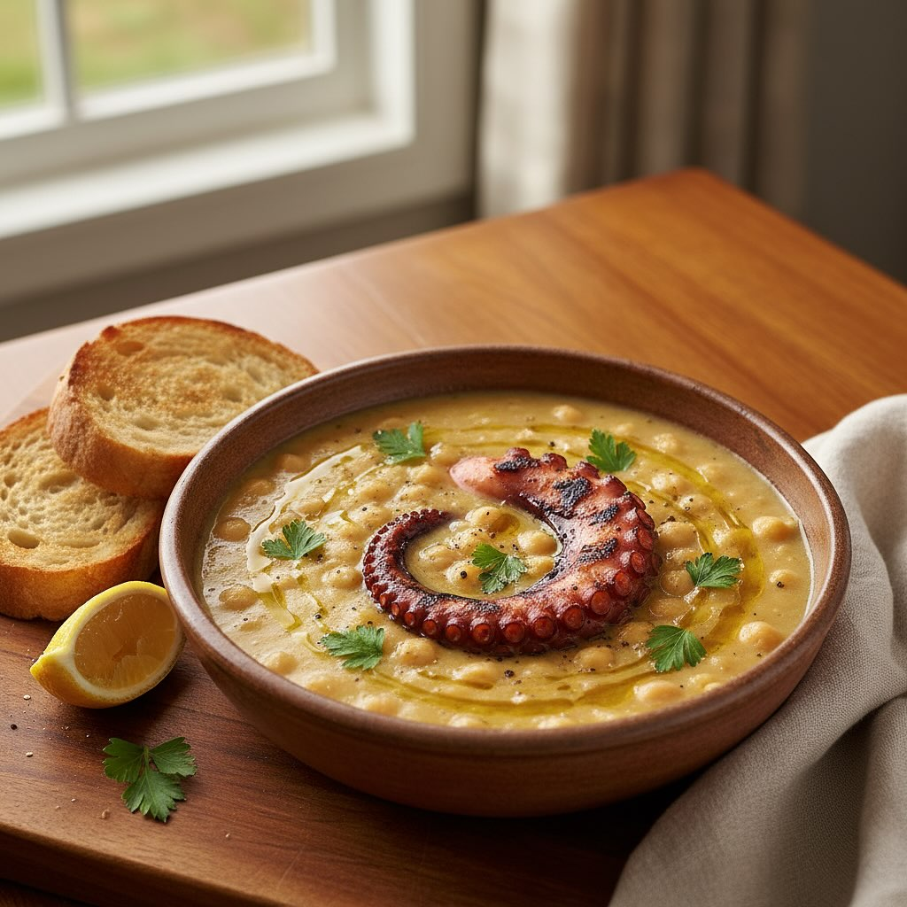

# Zuppa rustica di ceci e polpo, con il polpo “affumicato” alla brace e crostoni d

Zuppa rustica di ceci e polpo, con il polpo “affumicato” alla brace e crostoni di pane all’aglio. Porzioni: 4 Tempo totale: 3 h (compresa la marinatura e la cottura dei ceci) Ingredienti - 350 g di ceci secchi (oppure 2 barattoli da 400 g già cotti) - 1 polpo di circa 1 kg - 4–5 cucchiai di olio extravergine d’oliva - 1 cipolla media - 1 costa di sedano - 1 carota - 2 spicchi d’aglio (più 1 spicchio extra per strofinare il pane) - 400 g di pomodori pelati (o datterini maturi a pezzetti) - 1 rametto di rosmarino - Qualche fogliolina di timo fresco - ½ litro di brodo vegetale o di pesce - Sale grosso e fino, pepe nero q.b. - Peperoncino (facoltativo) - 4 fette spesse di pane casereccio 1. Preparazione dei ceci • Secchi: mettili in ammollo 12 h, scolali e cuocili in 1,2 l d’acqua con sedano, mezza cipolla e rosmarino per 1–1,5 h; sala a fine cottura e conserva un po’ di acqua di cottura. • In barattolo: scolali, sciacquali e saltali in padella con olio, timo, sale e pepe. 2. Polpo • Sciacqua il polpo e sbollentalo 3 volte (5 s ciascuna). • Cuocilo in acqua salata con alloro per 40 min, scola e lascia raffreddare su una griglia. • Griglialo su brace o BBQ 4–5 min per lato finché non si colora. 3. Zuppa • Soffriggi in una casseruola 3 cucchiai d’olio con cipolla, carota, sedano e aglio. • Aggiungi i pomodori pelati e insaporisci 5–7 min. • Unisci i ceci (interi e in parte frullati), il brodo caldo, regola sale e pepe, lascia sobbollire 15 min (facoltativo: peperoncino). 4. Composizione • Taglia il polpo a pezzi, conserva qualche tentacolo intero. • Tosta i crostoni, strofina aglio e condisci con olio. • Versa la zuppa calda in fondine, disponi il polpo, irrora con olio crudo e decora con timo. Accompagna con i crostoni. Consigli finali - Qualche goccia di limone sul polpo grigliato - Per più sapore marino, usa metà acqua di cottura del polpo al posto del brodo - Servi con un Vermentino o una Falanghina ben freschi.

---

*Ricetta da @leguminando*
