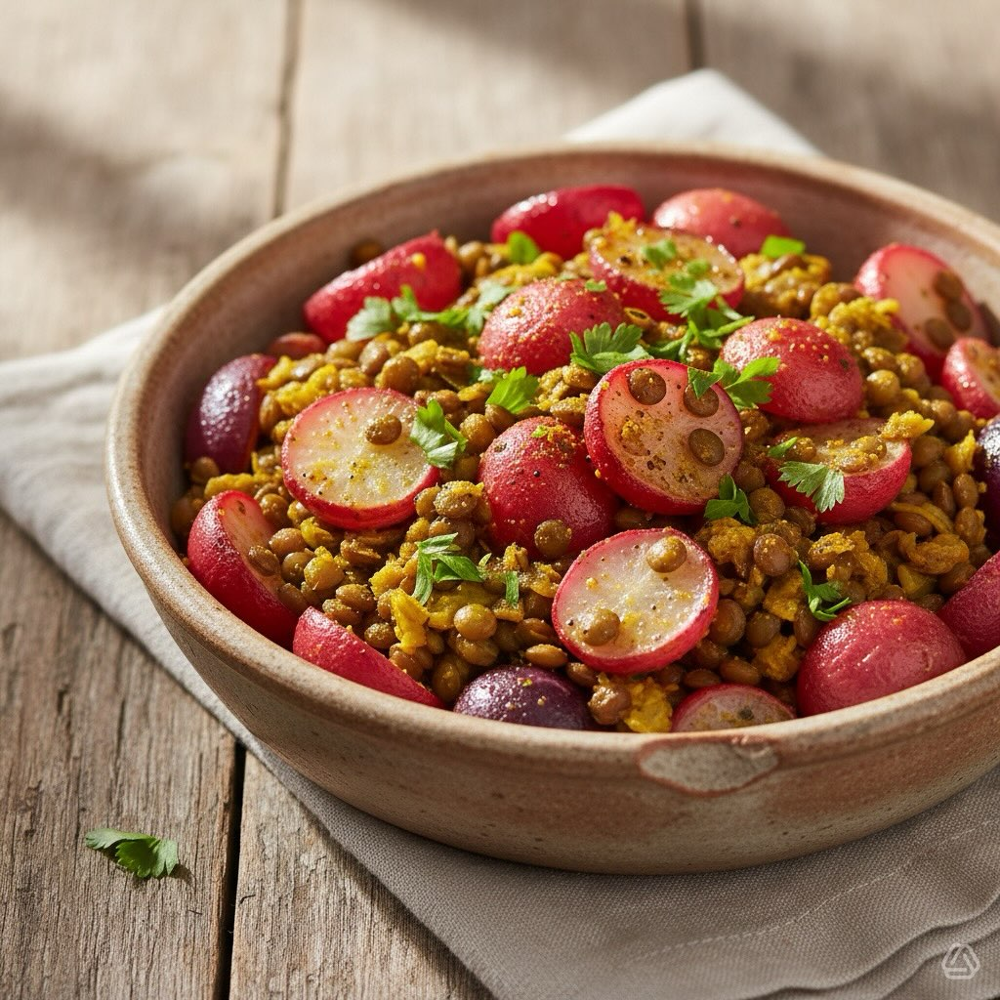

# #leguminando Ingredienti - 300 g di ravanelli - 200 g di lenticchie (o un mix di

#leguminando Ingredienti - 300 g di ravanelli - 200 g di lenticchie (o un mix di legumi a tua scelta) - 1 cipolla - 2 spicchi d’aglio - 2 cucchiai di olio d’oliva - 1 cucchiaino di cumino - 1 cucchiaino di curcuma - 500 ml di brodo vegetale - Sale e pepe q.b. - Prezzemolo fresco per guarnire # Procedura 1. **Preparazione dei legumi**: - Se usi legumi secchi, mettili in ammollo per almeno 4-6 ore o segui le istruzioni sulla confezione. Una volta ammorbiditi, cuocili in acqua bollente fino a quando sono teneri, poi scolali. 2. **Preparazione dei ravanelli**: - Lava i ravanelli e tagliali a metà o a quarti, a seconda della loro dimensione. 3. **Soffritto**: - In una padella grande, scalda l&#039;o’io d&#039;o’iva a fuoco medio. - Aggiungi la cipolla tritata e l’aglio schiacciato, cuoci fino a quando sono trasparenti. 4. **Aggiunta delle spezie**: - Aggiungi il cumino e la curcuma nella padella e mescola bene per amalgamare i sapori. 5. **Cottura dei ravanelli**: - Aggiungi i ravanelli nella padella e cuoci per circa 5 minuti, fino a quando iniziano a dorarsi. 6. **Unione dei legumi**: - Aggiungi i legumi cotti ai ravanelli, mescola bene. 7. **Aggiunta del brodo**: - Versa il brodo vegetale nella padella, porta a ebollizione, poi abbassa il fuoco e lascia sobbollire per circa 15 minuti. 8. **Condimento**: - Regola di sale e pepe secondo il tuo gusto. 9. **Guarnizione**: - Servi il piatto caldo, guarnito con prezzemolo fresco tritato.

---

*Ricetta da @leguminando*
