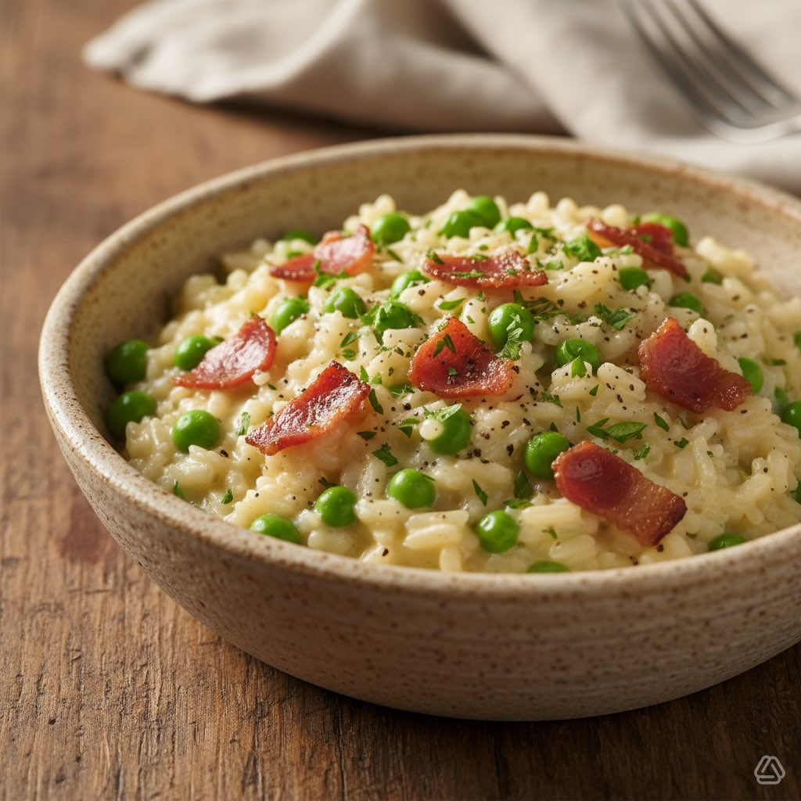

# #leguminando *Ingredienti per 4 persone** - **Riso Carnaroli o Arborio**: 320 g 

#leguminando *Ingredienti per 4 persone** - **Riso Carnaroli o Arborio**: 320 g - **Speck affumicato**: 120 g, tagliato a listarelle - **Piselli surgelati**: 250 g - **Panna da cucina**: 150 ml (light o classica, a piacere) - **Brodo vegetale caldo**: 1,2–1,4 l (preferibilmente fatto in casa o granulare a basso contenuto di sale) - **Cipolla**: 1 piccola (60–70 g), tritata finemente - **Vino bianco secco**: 70 ml - **Burro**: 30 g (20 g per la mantecatura, 10 g per il soffritto) - **Olio extravergine d’oliva**: 1 cucchiaio (10–15 ml) - **Parmigiano Reggiano grattugiato**: 60–80 g (a piacere) - **Sale e pepe nero**: q.b. - **Prezzemolo fresco tritato**: per guarnire (opzionale) **Procedimento** 1. **Preparazione Base**: Porta il brodo a leggero bollore e mantienilo caldo a fiamma bassissima. Scongela i piselli, se necessario, e scolali. 2. **Soffritto**: In una casseruola ampia, scalda l’olio e 10 g di burro. Aggiungi la cipolla tritata e falla appassire dolcemente senza farla colorire per 3–4 minuti. 3. **Tostatura**: Unisci il riso e mescola per 1–2 minuti finché i chicchi diventano lucidi. Sfuma con il vino bianco e lascia evaporare quasi del tutto. 4. **Cottura**: Aggiungi il brodo caldo un mestolo alla volta, mescolando spesso. A metà cottura (dopo circa 8–9 minuti, a seconda del riso) aggiungi i piselli. Continua a cuocere aggiungendo brodo quando necessario, per un totale di 15–17 minuti. Controlla la cottura “al dente”. 5. **Speck**: Mentre il risotto cuoce, tosta rapidamente lo speck in una padella antiaderente senza condimento a fiamma viva per 2–3 minuti fino a renderlo croccante; scolalo su carta assorbente. In alternativa, puoi aggiungerlo verso la fine della cottura per mantenerlo morbido. 6. **Mantecatura**: Quando il riso è quasi pronto, togli la casseruola dal fuoco, aggiungi la panna, 20 g di burro e il Parmigiano. Mescola energicamente per ottenere una consistenza cremosa. Aggiusta di sale e pepe. 7. **Completamento**: Incorpora lo speck (tenendone qualche pezzetto per guarnire) e mescola delicatamente. Lascia riposare per 1 minuto con il coperchio leggermente aperto.

---

*Ricetta da @leguminando*
