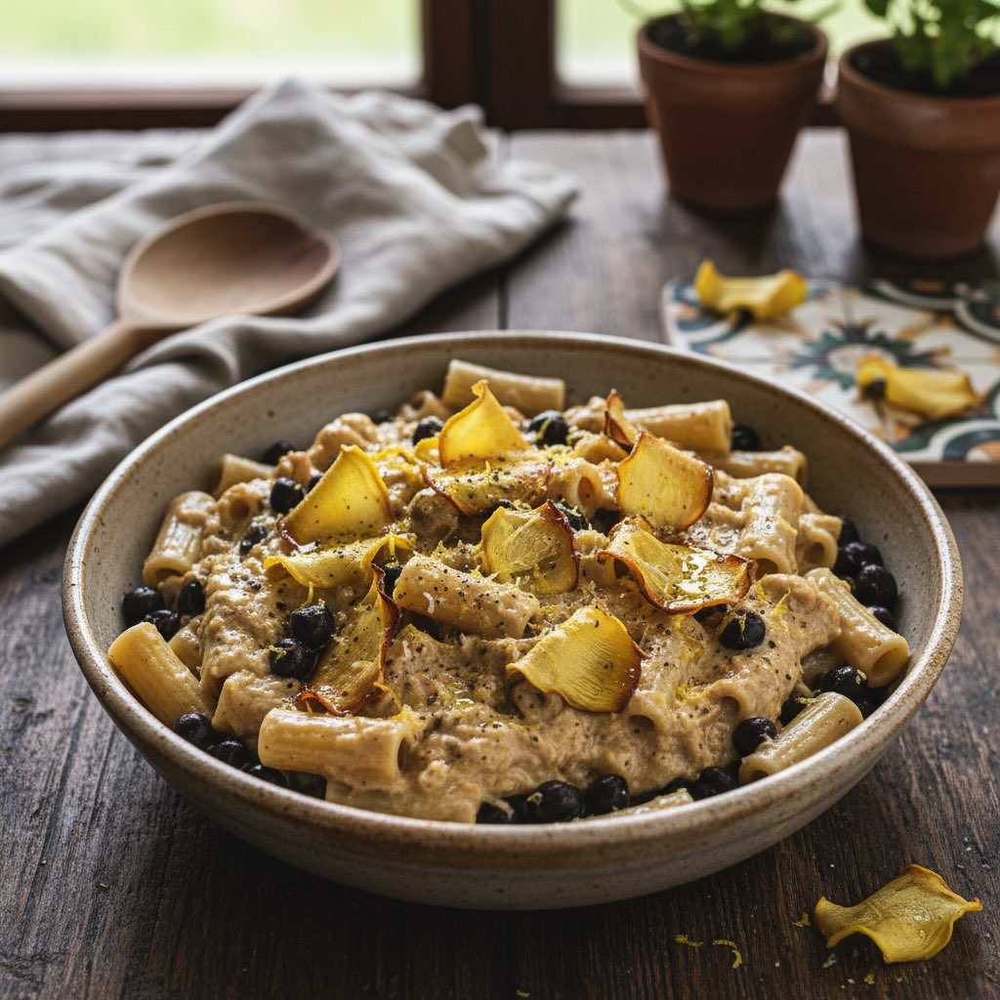

# #leguminando La pasta e ceci della domenica come non l’avete mai vista

#leguminando La pasta e ceci della domenica come non l’avete mai vista. I ceci si trasformano in una crema vellutata che avvolge la pasta come un abbraccio, il limone dona freschezza inaspettata, e le chips di carciofo croccanti sostituiscono la classica pancetta con un tocco primaverile e raffinato. Un piatto che profuma di tradizione ma guarda al futuro. ### Ingredienti (per 2 persone) # Per la crema di ceci: - 240 g di ceci precotti (scolati), preferibilmente neri per un contrasto cromatico - 1 spicchio d&#039;aglio - 1 rametto di rosmarino - 500 ml di brodo vegetale caldo - 2 cucchiai di olio extravergine d’oliva (EVO) - Sale e pepe nero Per i carciofi: - 2 carciofi romaneschi (o violetti) - Olio di semi per friggere - Sale fino Per la pasta: - 180 g di pasta corta (ditaloni rigati o mezzi rigatoni) - Scorza di 1 limone biologico - 1 cucchiaio di olio EVO a crudo - Pepe nero macinato al momento

---

*Ricetta da @leguminando*
