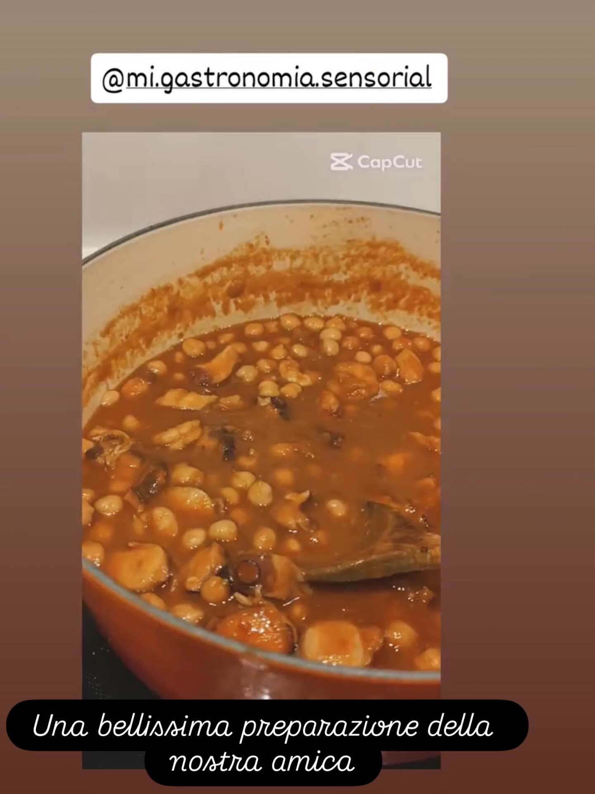

# #leguminando ### Ingredienti: **Lenticchie:** - 150g lenticchie rosse decorticat

#leguminando ### Ingredienti: **Lenticchie:** - 150g lenticchie rosse decorticate - 1 spicchio d’aglio - 1 foglia di alloro **Quinoa:** - 120g quinoa - 250ml acqua o brodo vegetale **Verdure Arrosto:** - 1 zucca (o 1/2 butternut) a cubetti - 1 cavolfiore (teste piccole) - 1 cipolla rossa a spicchi - 2 cucchiai olio d’oliva - 1 cucchiaino paprika dolce **Salsa Tahina:** - 3 cucchiai tahina - Succo di 1 limone - 1 cucchiaio olio d’oliva — # Procedimento: 1. **Cuoci le Lenticchie:** - Sciacqua e cuoci con aglio e alloro per 15 min. Scola e rimuovi aglio e alloro. 2. **Prepara la Quinoa:** - Sciacqua, cuoci con acqua per 15 min a fuoco medio. 3. **Verdure al Forno:** - Preriscalda il forno a 200°C. - Condisci le verdure con olio, paprika, sale e pepe. Inforna per 25-30 min. 4. **Salsa Tahina:** - Mescola tahina, succo di limone, olio e sale. Aggiungi acqua tiepida fino a consistenza desiderata. 5. **Assembla il Bowl:** - Base di quinoa, aggiungi lenticchie, zucca, cavolfiore, cipolla. Completa con salsa tahina, semi di sesamo e erbe fresche.

---

*Ricetta da @leguminando*
