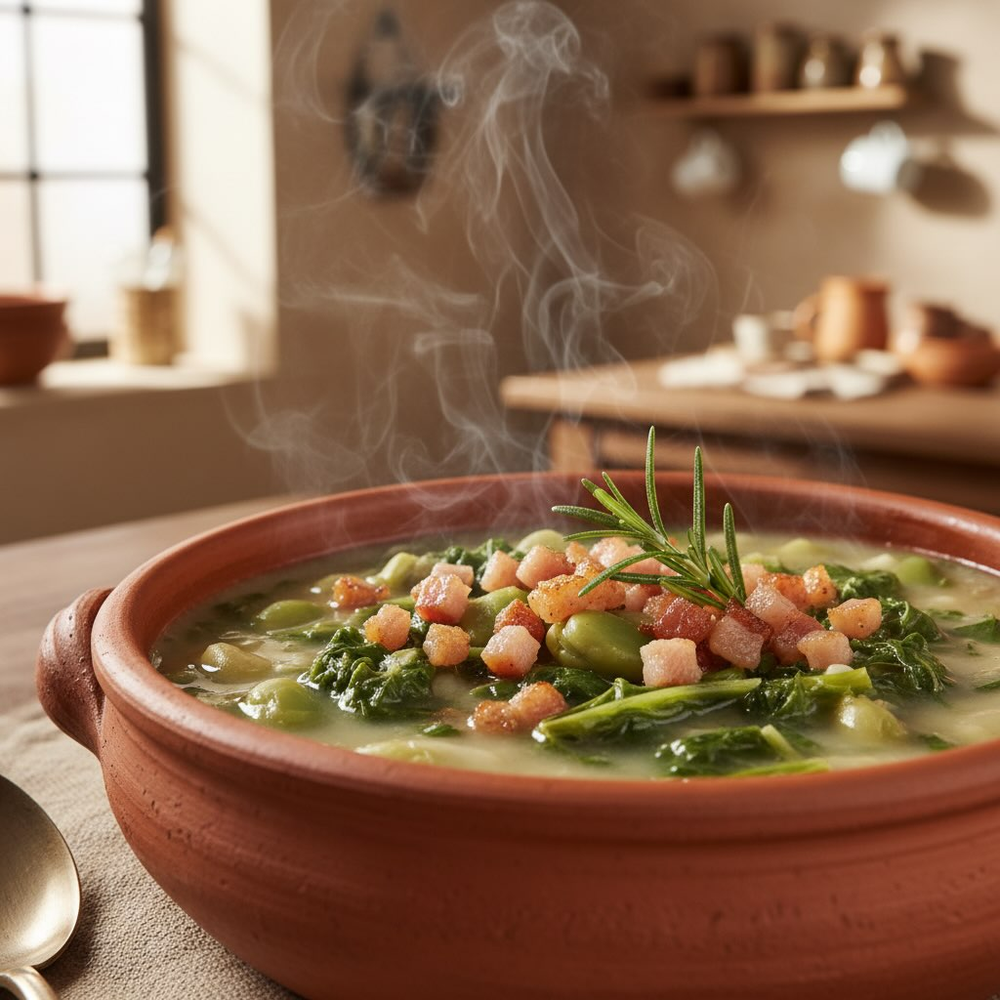

# #leguminando ### Porzioni: 4 | Tempo: 60 min | Difficoltà: Facile **Ingredienti 

#leguminando ### Porzioni: 4 | Tempo: 60 min | Difficoltà: Facile **Ingredienti (dosi precise):** - 300 g di fave secche (o 500 g fresche) - 400 g di cicoria selvatica - 1 cipolla dorata (150 g) - 2 spicchi d’aglio - 1 costa di sedano (80 g) - 100 g di guanciale o pancetta - 4 fette di pane nero raffermo (200 g) - 3 cucchiai di olio extravergine d’oliva (45 ml) - 1,5 L di brodo vegetale - 1 rametto di rosmarino - Sale e pepe nero **Procedimento:** 1. **Fave:** - Metti le fave in una pentola e coprile con brodo freddo (due dita sopra). - Porta a bollore e cuoci per **25-30 minuti a fuoco medio-basso** (livello 4 su 9) con il coperchio socchiuso. - Le fave sono pronte quando si schiacciano facilmente con il dorso di un cucchiaio. 2. **Cicoria:** - Pulisci e lava la cicoria due volte in acqua fredda. - Taglia a listarelle e, se desideri ridurre l’amarezza, immergila per 10 minuti in acqua salata. Scola bene. 3. **Soffritto:** - Scalda l’olio in una padella e aggiungi la cipolla tritata e l’aglio schiacciato. - Cuoci a fuoco medio per 3 minuti fino a quando la cipolla diventa trasparente. - Aggiungi la cicoria e saltala per 4 minuti. 4. **Unione:** - Trasferisci la cicoria nella pentola con le fave. - Rimuovi l’aglio e il rosmarino. - Frulla metà della zuppa con un frullatore a immersione o schiaccia le fave con una forchetta. 5. **Crostoni:** - Taglia il pane a cubetti e tostalo in forno a **180°C per 8 minuti** o in padella senza olio finché diventa croccante. 6. **Guanciale:** - Cuoci le listarelle di guanciale in padella a fuoco medio-basso **senza olio** per 5-6 minuti finché diventano croccanti. Scolale su carta assorbente. **Impiattamento:** Servi la zuppa in una ciotola, aggiungi i crostoni al centro, il guanciale sopra, un filo d’olio e pepe nero fresco. Ricca di fibre vegetali e proteine (18 g), con un basso indice glicemico. Il ferro biodisponibile delle fave è potenziato dalla vitamina C della cicoria, migliorando l’assorbimento. Contiene grassi saturi ridotti, ideale per una sazietà prolungata.

---

*Ricetta da @leguminando*
