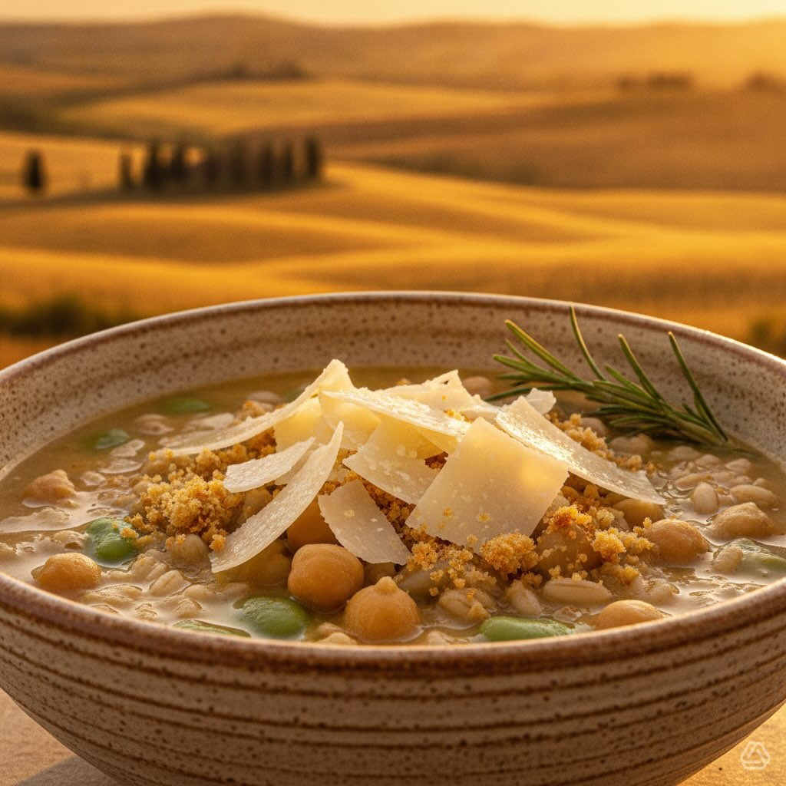

# #leguminando 🌿 **Zuppa di Farro e Ceci con Fave: Ricetta Deliziosa e Salutare! 🌿

#leguminando 🌿 **Zuppa di Farro e Ceci con Fave: Ricetta Deliziosa e Salutare! 🌿** **Ingredienti Principali:** - **Farro Perlato:** 200g - **Ceci:** 150g secchi o 400g precotti - **Fave:** 200g fresche o 120g secche - **Cipolla Rossa, Aglio, Sedano:** Tritati finemente - **Olio EVO, Sale, Pepe, Rosmarino fresco** **Guarnizione:** - **Pecorino Romano, Pangrattato Croccante, Olio al Rosmarino, Fior di Sale** **Crostini di Farro (opzionali):** - **Pane integrale, Olio EVO, Aglio** **Preparazione:** 1. **Cottura Legumi:** Ammollare e cuocere ceci e fave se secchi. 2. **Cottura Farro:** Bollire in acqua/brodo per 20 min. 3. **Crema Ceci-Fave:** Frullare legumi con olio e cipolla. 4. **Assemblaggio Zuppa:** Mescolare crema, farro, ceci interi, e verdure. 5. **Impiattamento:** Decorare con pecorino, pangrattato, e rosmarino. **Consigli dello Chef:** - **Texture Perfetta:** Combina crema vellutata, farro al dente, e ceci interi. - **Ingredienti Freschi:** Preferisci il farro perlato e il pecorino stagionato. Buon appetito! 🍲✨ #ZuppaGourmet #CucinaItaliana #RicettaSana

---

*Ricetta da @leguminando*
