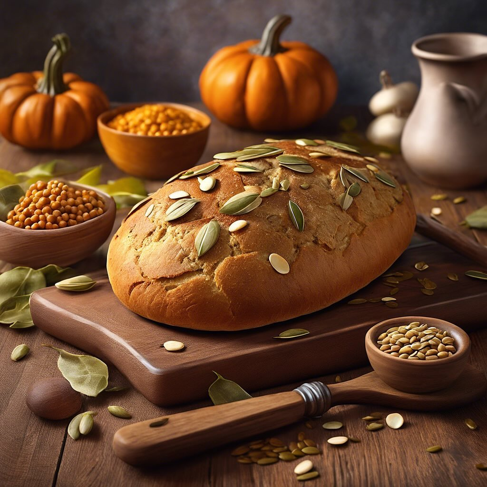

# pane casalingo preparato con farina di carrube, ceci, lenticchie, semi di giraso

pane casalingo preparato con farina di carrube, ceci, lenticchie, semi di girasole, semi di chia e semi di zucca. ### Ingredienti - 200 g di farina di carrube - 100 g di farina di ceci &#064;alcenerobiologico - 100 g di lenticchie (cotte e schiacciate) - 50 g di semi di girasole - 30 g di semi di chia - 30 g di semi di zucca - 300 ml di acqua tiepida - 1 bustina di lievito di birra secco - 1 cucchiaino di sale - 1 cucchiaio di olio d’oliva &#064;slowfoodlivorno &#064;slowfood_costaetruschiaps ### Procedimento 1. **Preparazione dell’impasto**: - In una ciotola capiente, mescola le farine di carrube e ceci, il sale, i semi di girasole, i semi di chia e i semi di zucca. - In un’altra ciotola, sciogli il lievito nell’acqua tiepida e lascia riposare per circa 5 minuti. - Aggiungi l’acqua con il lievito e l’olio d’oliva alla miscela di farine. Mescola bene fino a ottenere un impasto omogeneo. 2. **Lievitazione**: - Copri la ciotola con un canovaccio umido e lascia lievitare l’impasto in un luogo caldo per circa 1-2 ore, o fino a quando non raddoppia di volume. 3. **Formatura del pane**: - Dopo la lievitazione, trasferisci l’impasto su una superficie infarinata e impasta delicatamente per qualche minuto. - Forma una pagnotta o dei panini a tuo piacere e posizionali su una teglia rivestita di carta da forno. 4. **Seconda lievitazione**: - Copri nuovamente con un canovaccio e lascia lievitare per altri 30-45 minuti. 5. **Cottura**: - Preriscalda il forno a 200°C. - Inforna il pane e cuoci per 25-30 minuti, o fino a quando la superficie è dorata e suona vuota quando picchiettata. 6. **Raffreddamento**: - Sforna il pane e lascialo raffreddare su una griglia prima di affettarlo. ### Consigli Puoi aggiungere erbe aromatiche o spezie a tuo piacere per arricchire il sapore del pane. Questo pane è ottimo da gustare con hummus, avocado o semplicemente con un filo d’olio d’oliva.

---

*Ricetta da @leguminando*
