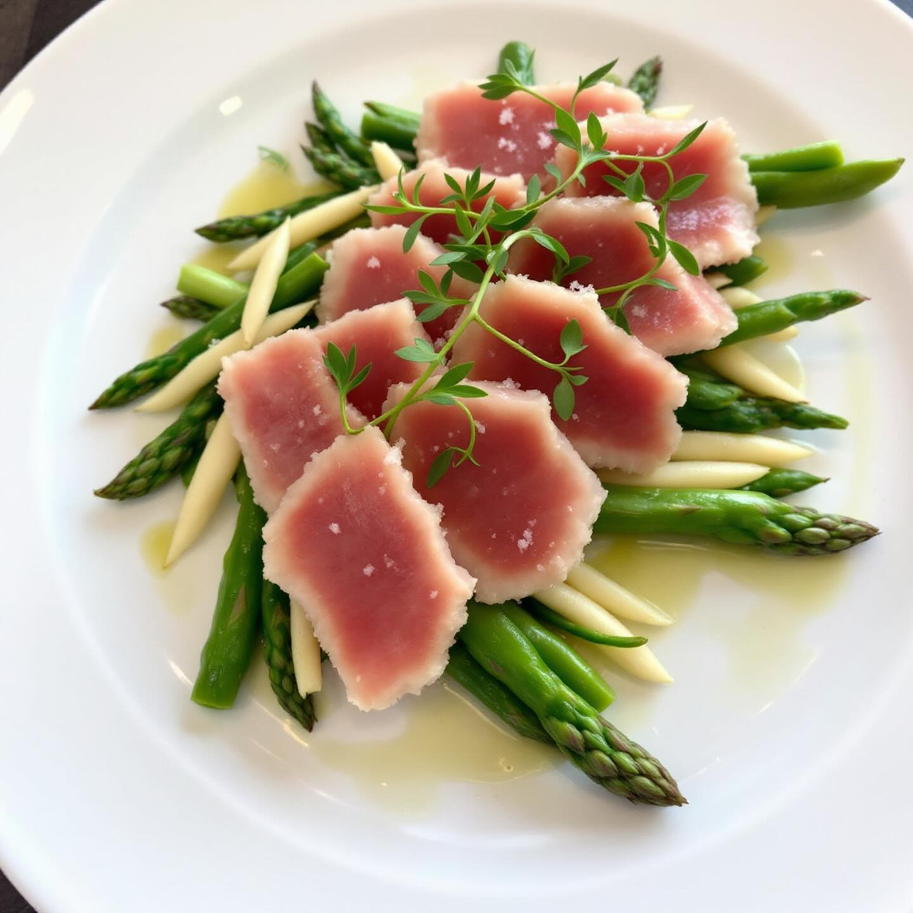

# ### Antipasto Misto con Tre Humus e Gamberoni Fritti #### Ingredienti: **Per l’h

### Antipasto Misto con Tre Humus e Gamberoni Fritti #### Ingredienti: **Per l’hummus di ceci e limone:** - 200 g di ceci cotti (in scatola o lessati) - 2 cucchiai di tahini - Succo di 1 limone - 1 spicchio d’aglio - Olio d’oliva q.b. - Sale e pepe q.b. **Per l’hummus di lenticchie e pomodori secchi:** - 200 g di lenticchie cotte - 50 g di pomodori secchi - 1 cucchiaio di olio d’oliva - Succo di limone q.b. - Sale e pepe q.b. **Per l’hummus di fagioli e zafferano:** - 200 g di fagioli bianchi cotti - 1 pizzico di zafferano (sciolto in un cucchiaio d’acqua calda) - 2 cucchiai di olio d’oliva - Succo di limone q.b. - Sale e pepe q.b. **Per i gamberoni fritti:** - 300 g di code di gamberoni - Farina q.b. - Olio per friggere **Guarnizione:** - Fette di carota - Fette di cetriolo **Accompagnamento:** - Bicchiere di spritz #### Preparazione: 1. **Hummus di ceci e limone:** In un frullatore, unisci i ceci, il tahini, il succo di limone, l’aglio, un filo d’olio d’oliva, sale e pepe. Frulla fino ad ottenere una crema liscia e omogenea. 2. **Hummus di lenticchie e pomodori secchi:** Frulla insieme le lenticchie, i pomodori secchi, l’olio d’oliva, il succo di limone, sale e pepe fino a ottenere una consistenza cremosa. 3. **Hummus di fagioli e zafferano:** In un frullatore, combina i fagioli, lo zafferano sciolto, l’olio d’oliva, il succo di limone, sale e pepe. Frulla fino a ottenere una crema liscia. 4. **Gamberoni fritti:** Infarina le code di gamberoni e friggile in abbondante olio caldo fino a doratura. Scolale su carta assorbente. 5. **Presentazione:** In un piatto da portata, disponi i tre humus in piccole ciotole o mucchietti. Metti al centro i gamberoni fritti e guarnisci con fette di carote e cetriolo. Servi con un bicchiere di spritz.

---

*Ricetta da @leguminando*
