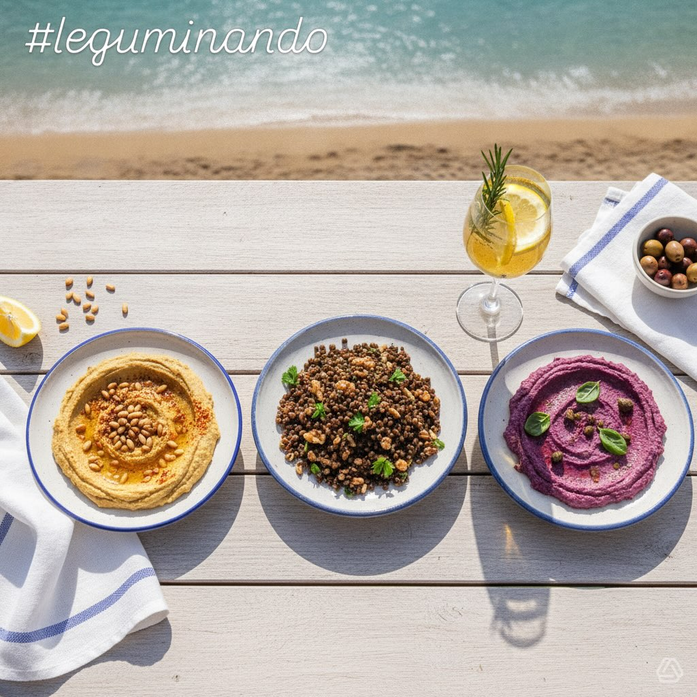

# **Bowl Estivo Quinoa &amp; Ceci con Avocado e Dressing al Lime** Goditi una poke

**Bowl Estivo Quinoa &amp; Ceci con Avocado e Dressing al Lime** Goditi una poke bowl fresca e nutriente, perfetta per l’estate! 🌿 **Ingredienti per 4 persone:** - **Base:** - Quinoa: 240 g - Ceci precotti: 400 g - Edamame: 200 g - **Dressing:** - Tahini: 60 ml - Succo di lime: 60 ml - Zenzero e aglio: 3 g ciascuno - Olio evo: 30 ml - **Toppings:** - Avocado: 300 g - Pomodorini ciliegino: 200 g - Cetrioli: 150 g - Germogli: 80 g **Preparazione Rapida:** 1. **Cuoci la Quinoa:** Bollire 480 ml d’acqua con la quinoa per 15 minuti. 2. **Prepara Ceci ed Edamame:** Sgocciola i ceci e cuoci gli edamame. 3. **Dressing:** Mescola tahini, lime, zenzero, aglio e olio. 4. **Toppings:** Taglia avocado, pomodorini e cetrioli. 5. **Assemblaggio:** Metti tutto in una bowl e condisci con il dressing. Aggiungi erba cipollina e semi di sesamo. Un piatto unico e delizioso pronto in 35 minuti! 🍽️

---

*Ricetta da @leguminando*
