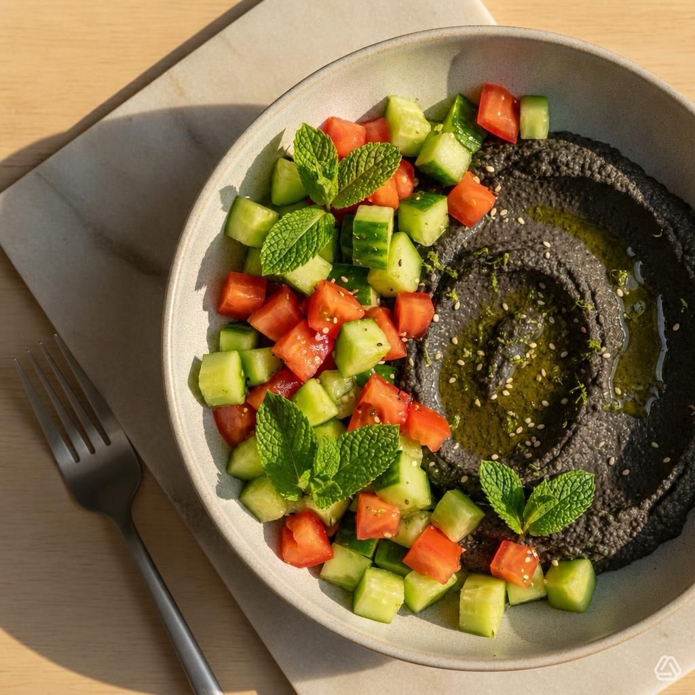

# Bowl di cetrioli e pomodori a quadrotti con hummus di ceci neri al lime e menta 

Bowl di cetrioli e pomodori a quadrotti con hummus di ceci neri al lime e menta Ingredienti - Per la bowl: - 1 cetriolo grande (o 2 piccoli), sbucciato a piacere e tagliato a cubetti (~2 cm) - 2 pomodori maturi (tipo cuore di bue o datterini grandi), tagliati a cubetti (~2 cm) - 8–10 foglie di menta fresca spezzettate - 1–2 cucchiai di olio extravergine d’oliva - Sale e pepe q.b. - 1/2 cucchiaino di succo di lime (opzionale) - Semi di sesamo o za’atar per guarnire (opzionale) - Per l’hummus di ceci neri al lime: - 240 g ceci neri cotti (scolati) — se usi secchi, ammolla e cuoci prima - 2–3 cucchiai di olio extravergine d’oliva (più q.b. per finire) - 1 spicchio d’aglio piccolo (opzionale, o 1/2 se preferisci leggero) - Succo di 1 lime (circa 1–2 cucchiai) + scorza grattugiata di 1/2 lime (opzionale) - 2–3 cucchiai di acqua o liquido di cottura per regolare consistenza - 1/2 cucchiaino di cumino in polvere (facoltativo) - Sale q.b. - Pepe nero q.b. Procedimento 1. Prepara la bowl: unisci cetriolo + pomodoro in una ciotola, aggiungi menta, olio, sale, pepe e il mezzo cucchiaino di succo di lime. Mescola delicatamente e lascia riposare mentre fai l’hummus. 2. Hummus: in un frullatore o robot da cucina metti i ceci neri, l’aglio (se lo usi), il succo di lime, la scorza, il cumino, sale e pepe. Frulla aggiungendo l’olio a filo. Se troppo denso, aggiungi 1–2 cucchiai di acqua o liquido di cottura fino a ottenere una crema liscia. Assaggia e regola sale/lime. Deve risultare cremoso ma non troppo liquido. #leguminando

---

*Ricetta da @leguminando*
