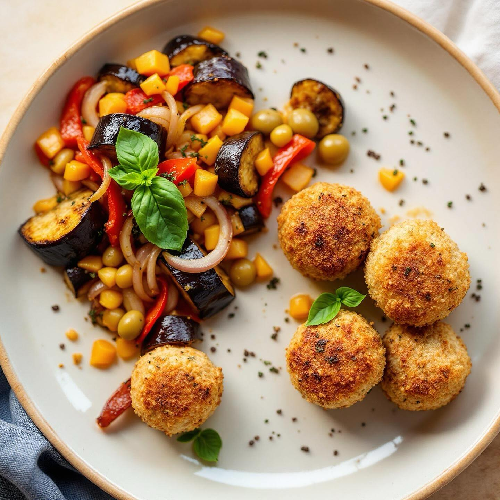

# Caponata estiva &amp; polpette di baccalà alle lenticchie 🌿🍆🐟 Ingredienti (per 4

Caponata estiva &amp; polpette di baccalà alle lenticchie 🌿🍆🐟 Ingredienti (per 4 persone) • 2 melanzane medie a cubetti • 1 peperone rosso a listarelle • 1 cipolla bianca a fettine • 1 spicchio d’aglio schiacciato • 100 g di olive verdi denocciolate Per il battuto • 2 coste di sedano • 1 carota • 1 cipolla rossa • 1 spicchio d’aglio • 200 g di polpa di pomodoro • 8–10 pomodori pachino rossi • Olio evo, sale, pepe q.b. Polpette di baccalà • 300 g di baccalà lessato e sminuzzato • 80 g di farina di lenticchie • Prezzemolo tritato, sale, pepe • Olio di semi per friggere Preparazione in breve 1) Battuto: soffriggi cipolla rossa, aglio, sedano e carota tritati. Aggiungi i pachino a pezzetti e la polpa, cuoci 10’ a fuoco medio. 2) Verdure: in altra padella scalda un filo d’olio, rosola aglio, cipolla bianca, melanzane e peperone. Quando sono dorati aggiungi le olive e il sugo; amalgama 5’. 3) Polpette: mescola baccalà, farina di lenticchie, prezzemolo, regola sale e pepe. Forma palline e friggi in olio caldo fino a doratura. 4) Impiatta la caponata tiepida con accanto 4–5 polpette croccanti. Consigli: • Lascia riposare la caponata almeno 1 h per farle sprigionare tutti i profumi. • Scolala leggermente prima di servire, così resta asciutta ma succosa.

---

*Ricetta da @leguminando*
