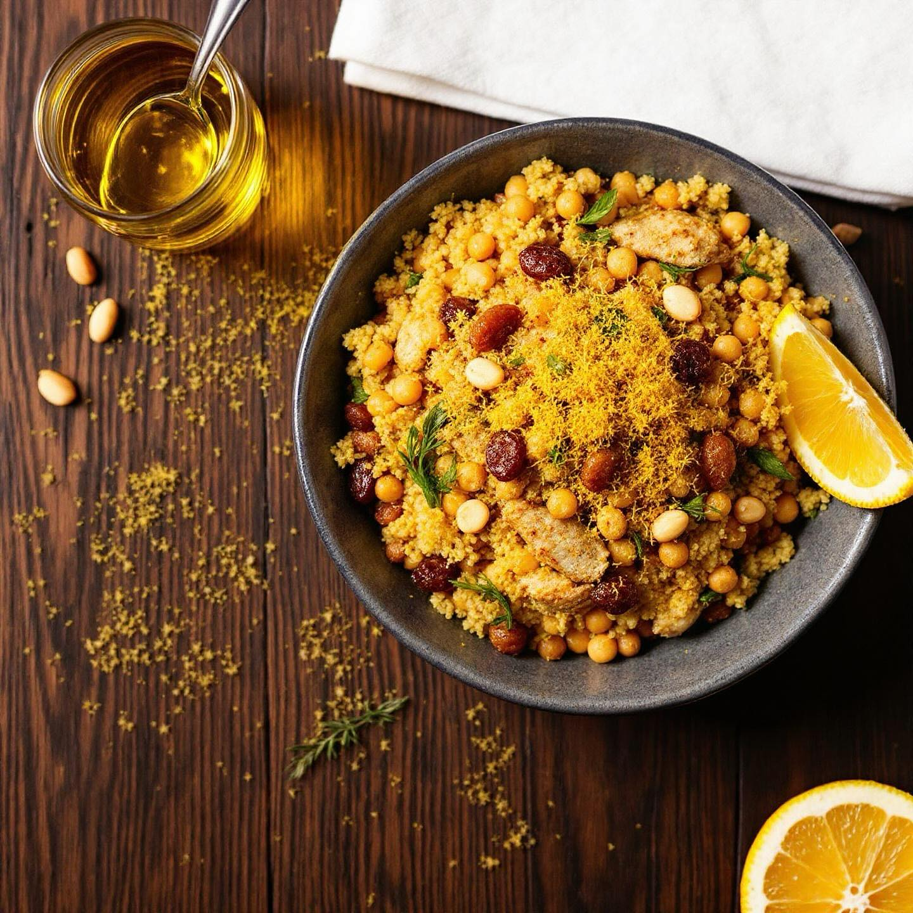

# Cuscus di ceci e lenticchie con le sarde Ingredienti (4 persone) - Per il “cuscu

Cuscus di ceci e lenticchie con le sarde Ingredienti (4 persone) - Per il “cuscus” di ceci e lenticchie: - 300 g semolino di ceci e lenticchie (farina/processato in granelli: 50% ceci, 50% lenticchie) - 350–380 ml acqua salata tiepida - 2 cucchiai olio extravergine d’oliva - Sale q.b. - Per il condimento (stile pasta con le sarde): - 600 g filetti di sarde fresche (pulite) o sardine se piccole - 1 cipolla media, affettata sottilmente - 2 mazzi finocchietto selvatico (solo le foglie e le cimette) o 150 g finocchietto lessato e tritato - 4 acciughe sott’olio (facoltative, per sciogliere il sapore) - 60 g uvetta ammollata in acqua tiepida e scolata - 40 g pinoli tostati - 300 g passata di pomodoro (o 2 pomodori pelati schiacciati) - 1 bustina di zafferano (o pistilli, sciolti in 2 cucchiai d’acqua calda) - Olio extravergine d’oliva q.b. - Pepe nero q.b. - Pangrattato tostato per guarnire (2–3 cucchiai tostati in poco olio fino a doratura) - Scorza grattugiata di 1 arancia (facoltativa, per una nota aromatica) Preparare il condimento : - In una padella ampia scalda 4–5 cucchiai d’olio. Soffriggi la cipolla a fuoco dolce fino a che sia morbida. - Aggiungi le acciughe (se usi) e fallo sciogliere con il cucchiaio. - Aggiungi l’uvetta e i pinoli; mescola. Sciogli lo zafferano nell’acqua calda e incorporalo al sugo. - A fuoco medio-alto, aggiungi le sarde: se sono filetti piccoli, cuoci 4–6 minuti finché sono morbide ma non sfatte; se sono intere e grandi, riduci il tempo e controlla la cottura. - Se ti piace la nota agrumata, grattugia un po’ di scorza d’arancia e mescola fuori dal fuoco. 3. Assemblaggio: - Metti il cuscus di ceci e lenticchie caldo in una grande ciotola o in piatti singoli. - Versa il condimento con le sarde sopra, mescola delicatamente per distribuire e lascia riposare 2 minuti per far legare sapori. - Completa con pangrattato tostato. Un filo d’olio crudo a crudo all’ultimo aggiunge brillantezza.

---

*Ricetta da @leguminando*
