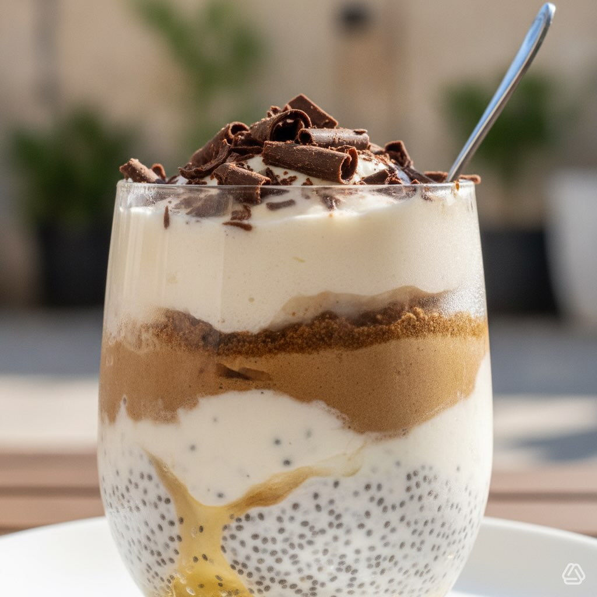

# Ecco la ricetta per un dolce estivo semifreddo con yogurt greco, semi di chia, m

Ecco la ricetta per un dolce estivo semifreddo con yogurt greco, semi di chia, miele, caffè e polvere di carrube. ### Ingredienti - 500 g di yogurt greco - 3 cucchiai di semi di chia - 3 cucchiai di miele - 200 ml di caffè espresso freddo - 2 cucchiai di polvere di carrube - 1 cucchiaino di estratto di vaniglia - Scaglie di cioccolato fondente per guarnire (opzionale) ## Preparazione 1. **Preparare il composto di yogurt:** - Mescola lo yogurt greco con i semi di chia, 2 cucchiai di miele e l’estratto di vaniglia in una ciotola. - Lascia riposare in frigorifero per almeno 30 minuti per permettere ai semi di chia di gonfiarsi. 2. **Preparare il caffè:** - Prepara il caffè espresso e lascialo raffreddare completamente. 3. **Assemblare il dolce:** - In una pirofila o in bicchieri individuali, versa uno strato del composto di yogurt. 4. **Aggiungere il caffè:** - Versa uno strato di caffè freddo sopra il composto di yogurt. 5. **Spolverare con carrube:** - Spolvera leggermente con la polvere di carrube. 6. **Stratificazione:** - Ripeti il processo di stratificazione fino a esaurire gli ingredienti, terminando con uno strato di yogurt e una spolverata finale di carrube. 7. **Raffreddare:** - Copri con pellicola trasparente e lascia riposare in frigorifero per almeno 4 ore, o tutta la notte per ottenere la consistenza ideale.

---

*Ricetta da @leguminando*
