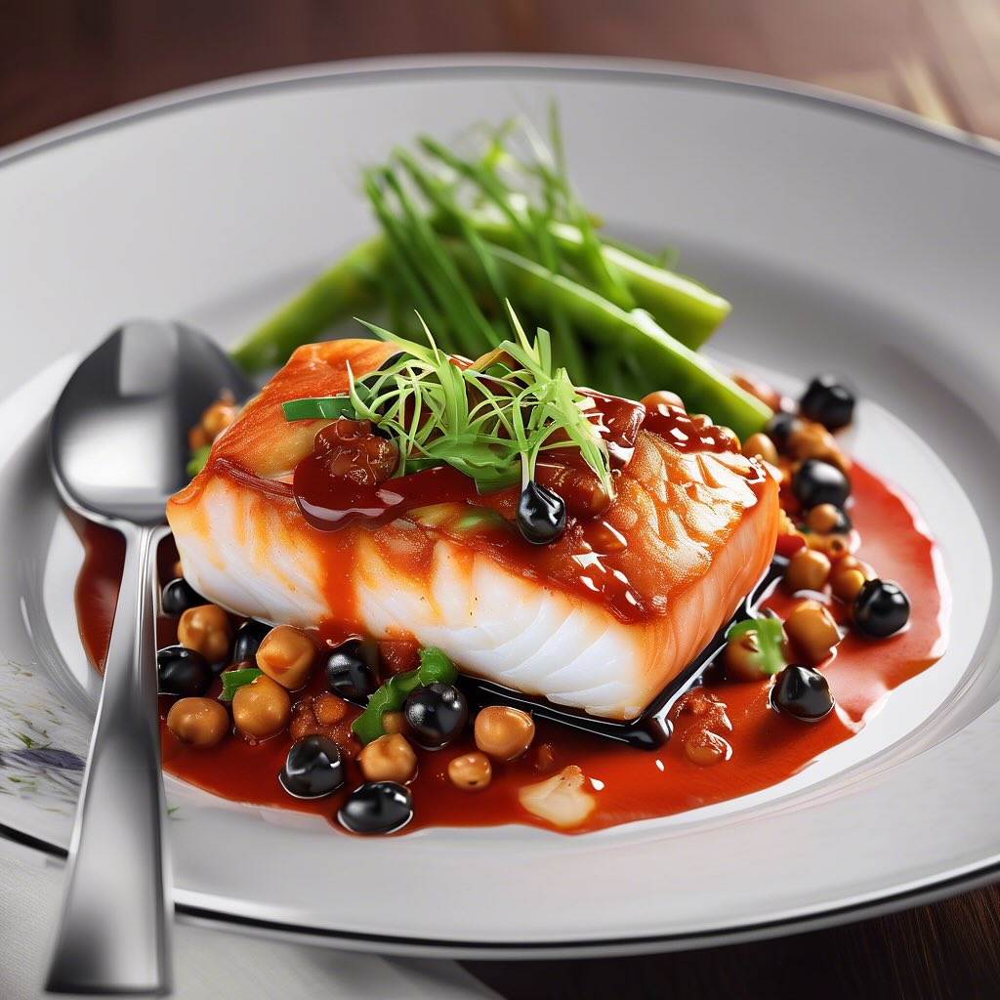

# Ecco una deliziosa ricetta per un antipasto di insalata di ceci con tonno, aglio

Ecco una deliziosa ricetta per un antipasto di insalata di ceci con tonno, aglio, cipolla rossa e pane croccante! ### Ingredienti: - 400 g di ceci lessati (in scatola o freschi) - 250 g di filetti di tonno in olio d’oliva (sgocciolati) - 2 spicchi d’aglio, tagliati a dadini - 1 cipolla rossa, affettata finemente - 150 g di pane (meglio se tipo ciabatta o baguette), tagliato a cubetti - Olio extravergine d’oliva q.b. - Pepe nero macinato fresco q.b. - Sale q.b. - Prezzemolo fresco tritato (opzionale, per guarnire) ### Procedimento: 1. **Preparare i ceci**: Se usi ceci in scatola, scolali e sciacquali bene sotto acqua corrente. Se usi ceci freschi, lessali in acqua salata fino a quando sono teneri e lasciali raffreddare. 2. **Preparare il pane**: In una padella antiaderente, scalda un filo d’olio d’oliva e aggiungi i cubetti di pane. Fai tostare a fuoco medio finché non sono dorati e croccanti. Metti da parte. 3. **Mescolare gli ingredienti**: In una ciotola grande, unisci i ceci, i filetti di tonno sbriciolati, i dadini di aglio e le fettine di cipolla rossa. 4. **Condire l’insalata**: Aggiungi un generoso filo d’olio d’oliva e una spolverata di pepe nero. Mescola bene per amalgamare tutti gli ingredienti. Assaggia e aggiusta di sale se necessario. 5. **Servire**: Prima di servire, aggiungi i cubetti di pane croccante all’insalata e mescola delicatamente per non rompere il tonno. Se vuoi, guarnisci con prezzemolo fresco tritato. 6. **Presentazione**: Servi l’insalata in piccole ciotole o su un piatto da portata, accompagnata da un ulteriore filo d’olio d’oliva e pepe a piacere.

---

*Ricetta da @leguminando*
