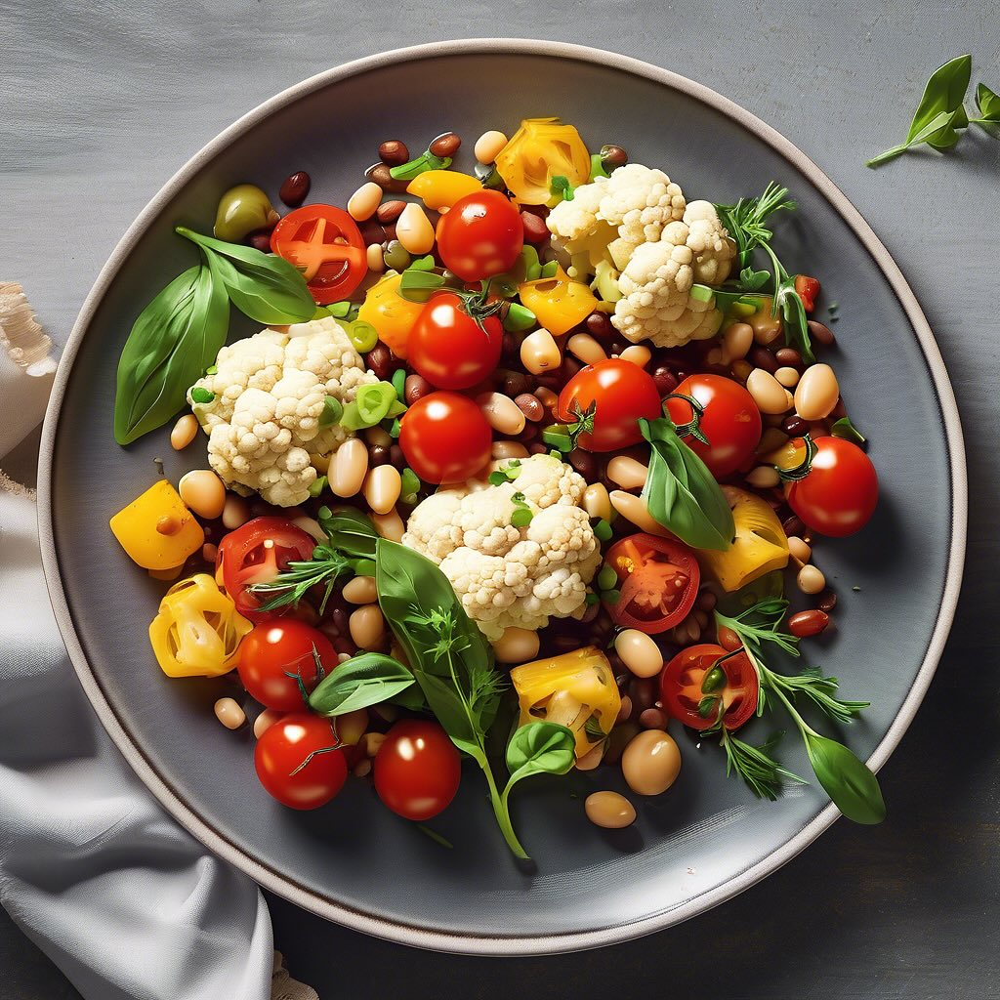

# Ecco una ricetta semplice e gustosa per un antipasto a base di cavolfiore, pomod

Ecco una ricetta semplice e gustosa per un antipasto a base di cavolfiore, pomodoro, fagioli e aglio: ### Ingredienti: - 1 cavolfiore medio - 2 pomodori maturi - 1 tazza di fagioli (cotti o in scatola, come fagioli cannellini o borlotti) - 2 spicchi d’aglio - Olio d’oliva - Sale e pepe q.b. - Prezzemolo fresco (opzionale, per guarnire) ### Preparazione: 1. **Preparare il cavolfiore**: - Lavare il cavolfiore e dividerlo in cimette. Portare a ebollizione una pentola d’acqua salata e cuocere le cimette di cavolfiore per circa 5-7 minuti, finché non sono tenere ma ancora croccanti. Scolarle e raffreddarle sotto acqua fredda per fermare la cottura. 2. **Preparare i pomodori**: - Tagliare i pomodori a cubetti. Se preferite, potete rimuovere i semi per una consistenza più leggera. 3. **Soffriggere l’aglio**: - In una padella, scaldare un paio di cucchiai di olio d’oliva. Aggiungere gli spicchi d’aglio tritati e farli soffriggere fino a quando non diventano dorati e fragranti. 4. **Unire gli ingredienti**: - Aggiungere i cubetti di pomodoro e le cimette di cavolfiore nella padella. Mescolare bene e cuocere per circa 5 minuti a fuoco medio, fino a quando i pomodori iniziano a rilasciare il loro succo. 5. **Aggiungere i fagioli**: - Incorporare i fagioli cotti, mescolare delicatamente e continuare a cuocere per altri 2-3 minuti. Aggiustare di sale e pepe a piacere. 6. **Servire**: - Trasferire il composto su un piatto da portata. Se desiderato, guarnire con prezzemolo fresco tritato. ### Consigli: - Questo antipasto può essere servito caldo o a temperatura ambiente. - È possibile aggiungere spezie come peperoncino per un tocco piccante. - Per un sapore extra, potete aggiungere un filo di aceto balsamico prima di servire.

---

*Ricetta da @leguminando*
