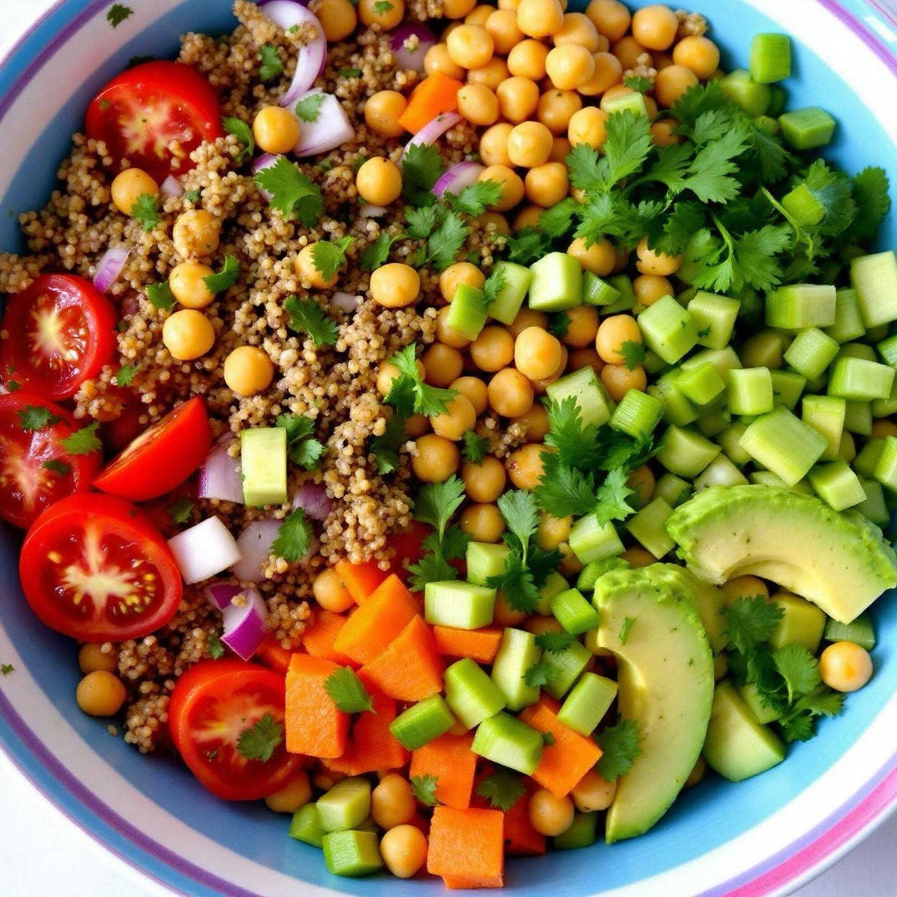

# ### Ingredienti: - 150 g di quinoa - 150 g di ceci secchi - 3 pomodori - 1 cipol

### Ingredienti: - 150 g di quinoa - 150 g di ceci secchi - 3 pomodori - 1 cipolla - 1 avocado - 1 gambo di sedano - 1 carota - Prezzemolo fresco q.b. - 2 cipollotti bianchi - Sale e pepe q.b. - Succo di limone (facoltativo) - Olio d’oliva q.b. ### Preparazione: 1. **Preparazione dei ceci**: Metti i ceci in ammollo in acqua fredda per almeno 8 ore (o durante la notte). Dopo l’ammollo, scolali e cuocili in acqua salata per circa 1-1,5 ore, fino a quando non sono teneri. Scolali e lasciali raffreddare. 2. **Cottura della quinoa**: Sciacqua la quinoa sotto acqua corrente. In una pentola, porta a ebollizione 300 ml di acqua con un pizzico di sale. Aggiungi la quinoa, copri e lascia cuocere a fuoco medio-basso per circa 15 minuti, finché l’acqua non è assorbita. Togli dal fuoco e lascia riposare per 5 minuti, poi sgrana con una forchetta. 3. **Preparazione delle verdure**: Lava e taglia a cubetti i pomodori, l’avocado e la carota. Affetta finemente la cipolla, il sedano e i cipollotti. 4. **Assemblaggio dell’insalata**: In una grande ciotola, unisci la quinoa cotta, i ceci, i pomodori, l’avocado, la cipolla, il sedano, la carota e i cipollotti. Aggiungi il prezzemolo fresco tritato. 5. **Condimento**: Condisci l’insalata con olio d’oliva, sale, pepe e, se desideri, un po’ di succo di limone per un tocco di freschezza. 6. **Servizio**: Mescola bene tutti gli ingredienti e lascia riposare in frigorifero per almeno 30 minuti prima di servire, in modo che i sapori si amalgamino.

---

*Ricetta da @leguminando*
