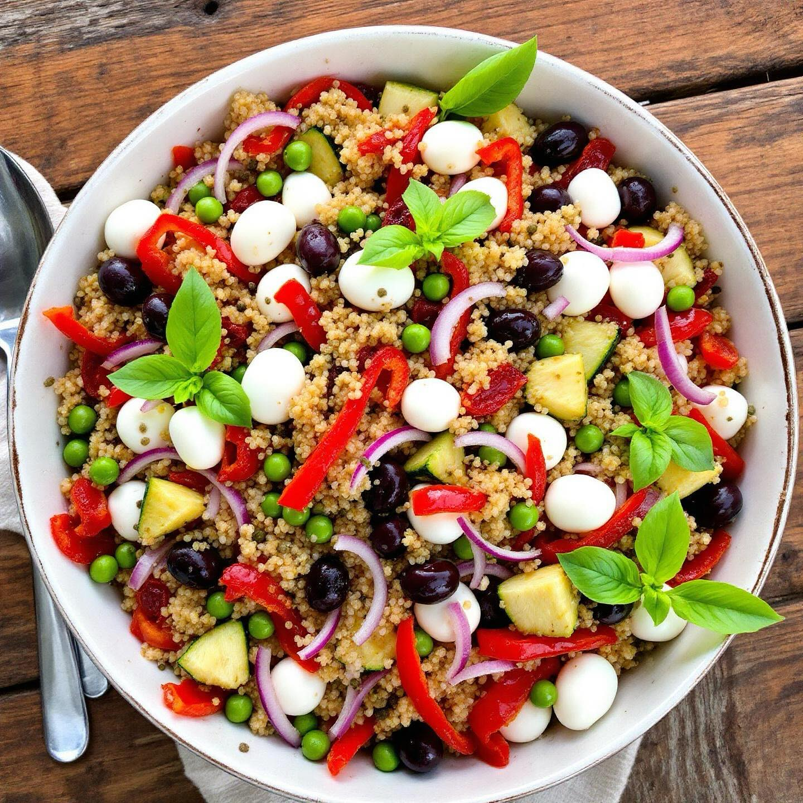

# #### Ingredienti: - 1 peperone rosso - 1 cipolla rossa - 1 zucchina media - 200g

#### Ingredienti: - 1 peperone rosso - 1 cipolla rossa - 1 zucchina media - 200g di quinoa - 150g di bocconcini di mozzarella - 5 pomodori secchi sott’olio - 6 foglie di basilico fresco - Succo di mezzo limone - Olio extravergine di oliva - Piselli (a piacere) - Olive (a piacere) - Capperi (a piacere) #### Preparazione: 1. **Cottura della quinoa**: Inizia sciacquando la quinoa sotto acqua corrente. Portare a ebollizione 400 ml di acqua in una pentola, aggiungere la quinoa e un pizzico di sale. Coprire e cuocere a fuoco basso per circa 15 minuti, fino a quando tutta l’acqua è assorbita. Togliere dal fuoco e lasciare riposare. 2. **Preparazione delle verdure**: Nel frattempo, lava e taglia a cubetti il peperone rosso, la cipolla rossa e la zucchina. In una padella con un filo d’olio extravergine di oliva, salta le verdure per circa 5-7 minuti, fino a quando sono tenere. Aggiungi i piselli e cuoci per ulteriori 2-3 minuti. 3. **Assemblaggio dell’insalata**: In una ciotola grande, unisci la quinoa cotta, le verdure saltate, i bocconcini di mozzarella tagliati a metà, i pomodori secchi tagliati a pezzetti, le olive e i capperi. 4. **Condimento**: Aggiungi il succo di limone, un filo d’olio extravergine di oliva e le foglie di basilico spezzettate. Mescola bene per amalgamare tutti gli ingredienti. 5. **Servire**: L’insalata può essere servita sia tiepida che fredda. È perfetta come piatto principale o contorno.

---

*Ricetta da @leguminando*
