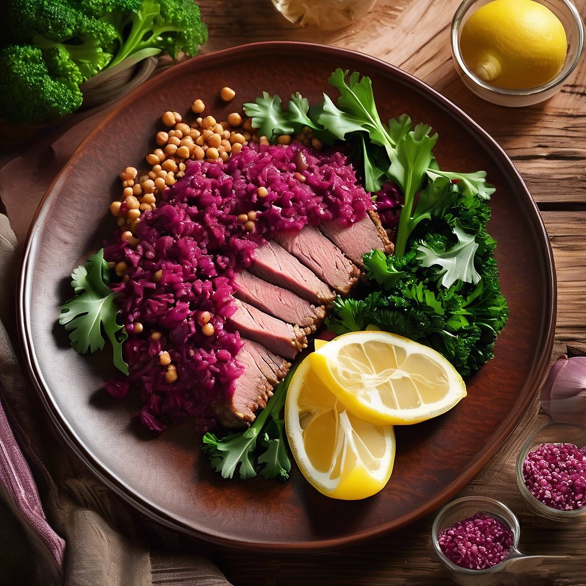

# ### Ingredienti: - 200 g di cavolo cappuccio - 150 g di radicchio rosso - 200 g 

### Ingredienti: - 200 g di cavolo cappuccio - 150 g di radicchio rosso - 200 g di fagioli borlotti (cotti) - 150 g di rape rosse (già cotte e tagliate a cubetti) - 1 carota (grattugiata) - 50 g di noci (tritate grossolanamente) - 50 g di formaggio feta (opzionale, sbriciolato) - Olio extravergine d’oliva q.b. - Aceto balsamico q.b. - Sale e pepe q.b. ### Procedimento: 1. **Preparazione delle verdure**: Lava il cavolo cappuccio e il radicchio rosso. Taglia il cavolo a strisce sottili e il radicchio a pezzetti. 2. **Mescolare gli ingredienti**: In una ciotola grande, unisci il cavolo cappuccio, il radicchio, i fagioli borlotti, le rape rosse e la carota grattugiata. Mescola bene per amalgamare tutti gli ingredienti. 3. **Condire l’insalata**: In una ciotolina a parte, prepara un condimento mescolando olio extravergine d’oliva, aceto balsamico, sale e pepe. Versa il condimento sull’insalata e mescola delicatamente. 4. **Aggiungere le noci e la feta**: Prima di servire, aggiungi le noci tritate e, se desideri, la feta sbriciolata. Mescola leggermente. 5. **Servire**: Lascia riposare l’insalata per qualche minuto affinché i sapori si amalgamino, poi servi fresca. ### Consigli: - Puoi arricchire ulteriormente l’insalata con ingredienti come semi di girasole o avocado. - Questa insalata è perfetta anche come contorno per piatti di carne o pesce.

---

*Ricetta da @leguminando*
