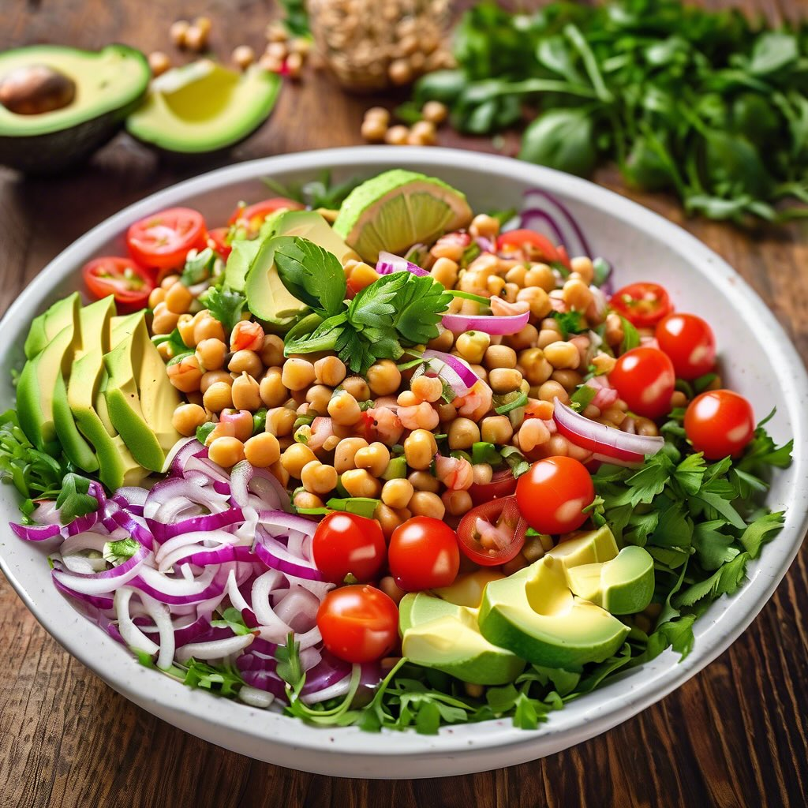

# ### Ingredienti: - 200 g di farro - 1 avocado maturo - 200 g di gamberi sgusciat

### Ingredienti: - 200 g di farro - 1 avocado maturo - 200 g di gamberi sgusciati (freschi o surgelati) - 200 g di ceci cotti (in scatola o lessati) - 1 pomodoro grande (opzionale) - 1 cipolla rossa piccola - Succo di 1 limone - 3 cucchiai di olio d’oliva - Sale e pepe q.b. - Prezzemolo fresco per guarnire ### Preparazione: 1. **Cottura del farro:** - In una pentola, portare a ebollizione dell’acqua salata. Aggiungere il farro e cuocere seguendo le istruzioni sulla confezione, di solito per 20-30 minuti, finché non è tenero. Scolare e lasciare raffreddare. 2. **Preparazione dei gamberi:** - Se si utilizzano gamberi freschi, sciacquarli sotto acqua corrente. In una padella, scaldare un cucchiaio di olio d’oliva e cuocere i gamberi per circa 3-5 minuti, fino a quando diventano rosa e opachi. Aggiustare di sale e pepe e lasciare raffreddare. 3. **Preparazione degli ingredienti:** - Nel frattempo, tagliare l’avocado a cubetti e il pomodoro a dadini (se si utilizza). Tritare finemente la cipolla rossa. 4. **Assemblaggio dell’insalata:** - In una ciotola grande, unire il farro raffreddato, i ceci, i gamberi, l’avocado, il pomodoro e la cipolla rossa. - Condire il tutto con il succo di limone, l’olio d’oliva, sale e pepe. Mescolare delicatamente per non schiacciare l’avocado. 5. **Impiattamento:** - Servire l’insalata in un piatto da portata e guarnire con prezzemolo fresco tritato.

---

*Ricetta da @leguminando*
