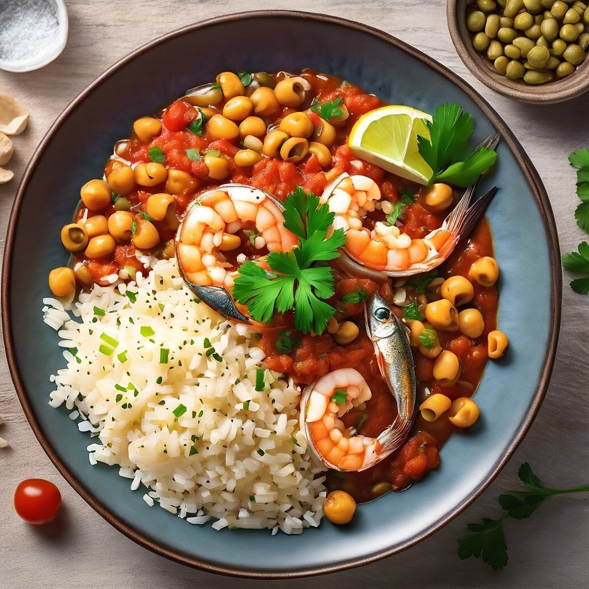

# ### Ingredienti - 200 g di sardine (fresche o in scatola) - 200 g di gamberoni (

### Ingredienti - 200 g di sardine (fresche o in scatola) - 200 g di gamberoni (sgusciati e puliti) - 50 g di anacardi tostati - 50 g di pistacchi sgusciati - 50 g di parmigiano grattugiato - 2 spicchi d’aglio (tritati) - 400 ml di passato di pomodoro - 200 g di legumi (ceci o fagioli, già cotti) - Un mazzetto di prezzemolo fresco (tritato) - Olio d’oliva q.b. - Sale e pepe q.b. - Peperoncino (facoltativo) ### Procedimento 1. **Preparazione delle Sardine e Gamberoni**: In una padella grande, scalda un po’ di olio d’oliva a fuoco medio. Aggiungi l’aglio tritato e soffriggi fino a doratura. Aggiungi le sardine e i gamberoni nella padella e cuoci per 3-4 minuti, fino a quando i gamberoni diventano rosa e le sardine sono cotte. Aggiusta di sale, pepe e, se desideri, un pizzico di peperoncino. 2. **Aggiunta del Passato di Pomodoro**: Versa il passato di pomodoro nella padella e mescola bene. Lascia cuocere a fuoco lento per circa 10 minuti, in modo che i sapori si amalgamino. 3. **Incorporare i Legumi**: Aggiungi i legumi già cotti nella padella e continua a cuocere per altri 5 minuti, mescolando delicatamente. 4. **Preparazione della Guarnizione**: In un mixer, unisci gli anacardi e i pistacchi. Frulla fino a ottenere una consistenza grossolana. Aggiungi il parmigiano grattugiato e il prezzemolo tritato, mescolando bene. 5. **Impiattamento**: Servi il piatto di sardine e gamberoni caldo, aggiungendo generosamente la guarnizione di anacardi, pistacchi e parmigiano sopra. Puoi decorare con un filo d’olio d’oliva e un po’ di prezzemolo fresco. ### Suggerimenti - Puoi servire questo piatto con del pane croccante o su un letto di riso per un pasto completo. - Se preferisci, puoi sostituire le sardine con altri pesci a tua scelta.

---

*Ricetta da @leguminando*
