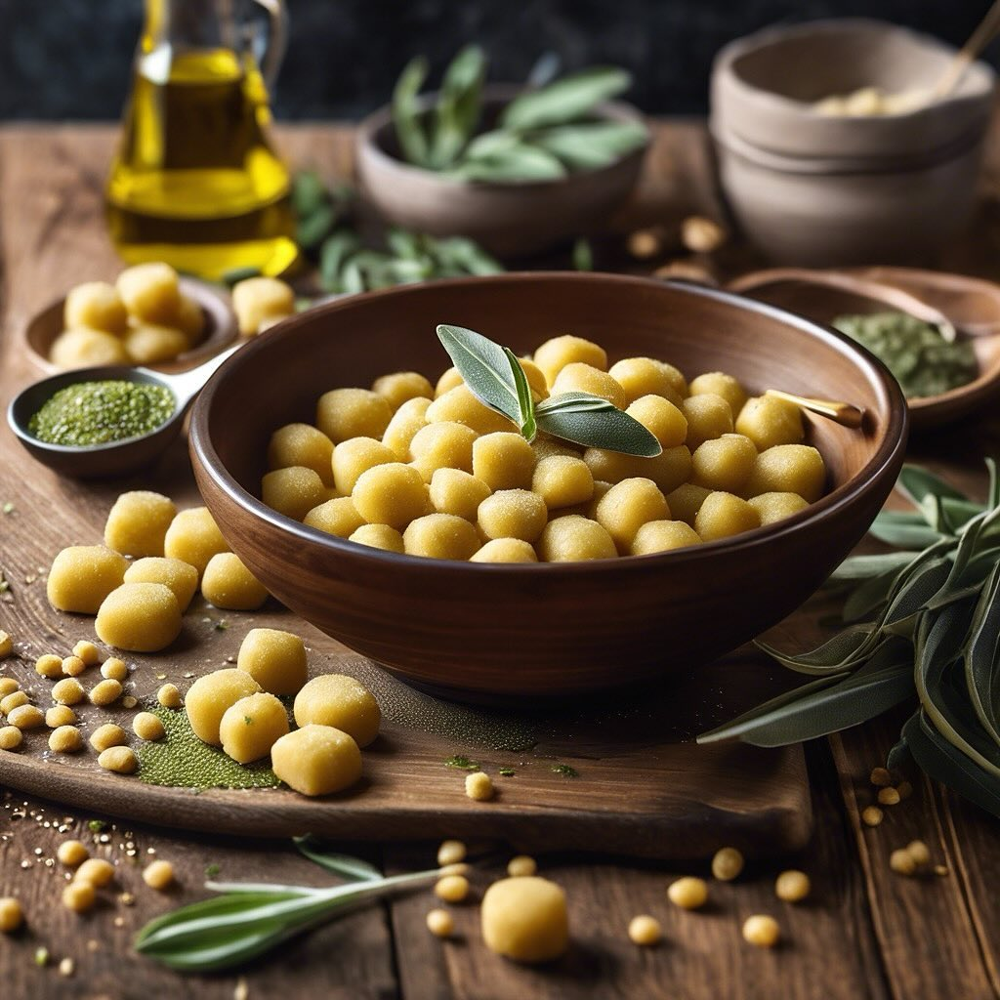

# ### Ingredienti - 250 g di farina di lenticchie (&#064;alcenerobiologico - 150 g

### Ingredienti - 250 g di farina di lenticchie (&#064;alcenerobiologico - 150 g di acqua (circa) - 1 pizzico di sale - 1 cucchiaio di olio d’oliva (opzionale) - farina di riso per spolverare ### Procedimento 1. **Preparazione dell’impasto**: In una ciotola, mescola la farina di lenticchie e il sale. Aggiungi gradualmente l’acqua e l’olio d’oliva, mescolando fino a ottenere un impasto omogeneo. L’impasto deve risultare morbido ma non appiccicoso. 2. **Formazione degli gnocchi**: Trasferisci l’impasto su una superficie infarinata e forma dei rotolini di circa 1-2 cm di diametro. Taglia i rotolini in piccoli pezzi di circa 2 cm. Puoi utilizzare una forchetta per creare delle righe sugli gnocchi, che aiuteranno a trattenere il sugo. 3. **Cottura**: Porta a ebollizione una pentola d’acqua salata. Cuoci gli gnocchi fino a quando non salgono in superficie, circa 2-3 minuti. Una volta cotti, scolali delicatamente. 4. **Condimento**: Puoi condire gli gnocchi con burro e salvia, sugo di pomodoro, o anche un pesto fresco. Scegli il condimento che preferisci e servili caldi.

---

*Ricetta da @leguminando*
