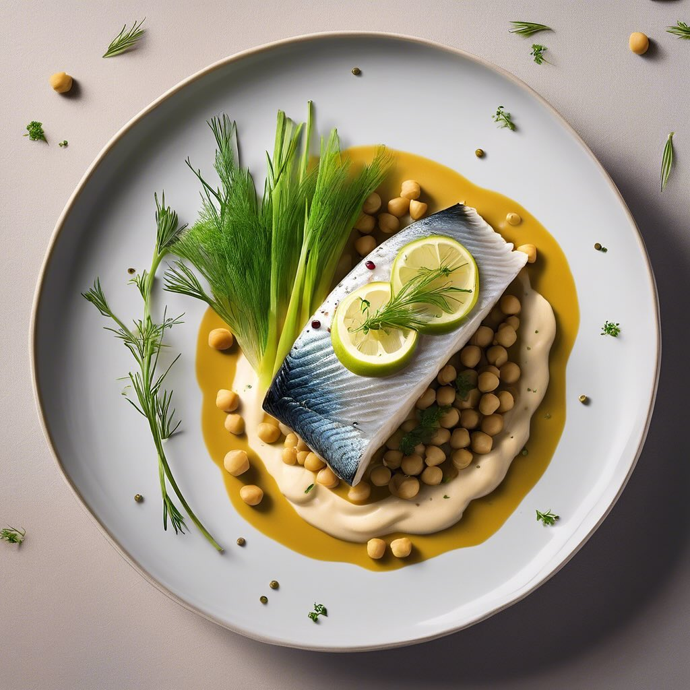

# ### Ingredienti - 2 peperoni gialli - 2 peperoni rossi - 400 g di fagioli borlot

### Ingredienti - 2 peperoni gialli - 2 peperoni rossi - 400 g di fagioli borlotti (cotti, possono essere in scatola) - 100 g di olive taggiasche denocciolate - 1 cipolla grande - 2 spicchi d’aglio - 400 g di pomodori pelati (o passata di pomodoro) - 4 cucchiai di olio extravergine d’oliva - Sale e pepe q.b. - Un pizzico di origano secco - Prezzemolo fresco tritato (per guarnire) ### Istruzioni 1. **Preparare gli ingredienti**: Lava i peperoni, rimuovi i semi e tagliali a strisce sottili. Affetta finemente la cipolla e trita gli spicchi d’aglio. 2. **Soffriggere**: In una casseruola capiente, scalda l’olio extravergine d’oliva a fuoco medio. Aggiungi la cipolla e l’aglio e soffriggi fino a quando la cipolla diventa trasparente. 3. **Aggiungere i peperoni**: Unisci le strisce di peperone nella casseruola e cuoci per circa 5-7 minuti, mescolando di tanto in tanto, finché non iniziano a diventare teneri. 4. **Unire i pomodori**: Aggiungi i pomodori pelati (o la passata di pomodoro) e mescola bene. Porta a ebollizione, quindi riduci il fuoco e lascia cuocere a fuoco lento per circa 15 minuti. 5. **Aggiungere i fagioli e le olive**: Incorpora i fagioli borlotti e le olive taggiasche. Aggiusta di sale, pepe e origano. Continua a cuocere per altri 10-15 minuti, finché il tutto è ben amalgamato e i sapori si sono fusi. 6. **Servire**: Una volta pronto, togli dal fuoco e guarnisci con prezzemolo fresco tritato. Servi caldo, magari accompagnato da pane croccante o riso.

---

*Ricetta da @leguminando*
