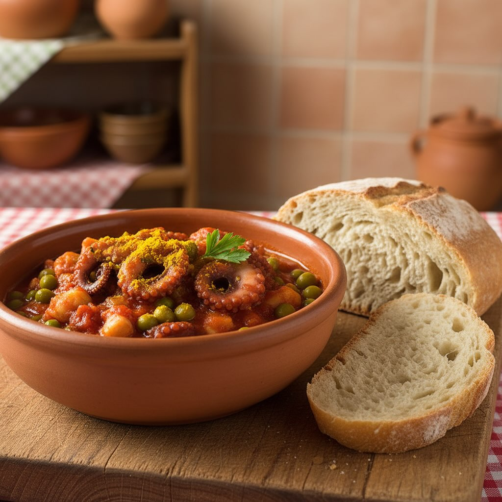

# ### Ingredienti - 500 g di moscardini già puliti - 250 g di piselli freschi - 20

### Ingredienti - 500 g di moscardini già puliti - 250 g di piselli freschi - 200 ml di passata di pomodoro - 500 ml di vino rosso - 2 cucchiai di cipolla rossa tritata - 1 cucchiaio di cipolla bianca tritata - Carote e sedano a cubetti piccoli - 3 spicchi d’aglio - 3 cucchiai di curcuma - Olio extravergine d’oliva (EVO) q.b. - Sale e pepe q.b. ## Procedimento 1. **Preparazione del soffritto**: In una casseruola capiente, scalda un filo d&#039;’lio EVO. Aggiungi la cipolla rossa e bianca tritata, l&#039;’glio, le carote e il sedano. Fai rosolare a fuoco medio fino a quando le verdure saranno morbide. 2. **Aggiunta dei moscardini**: Unisci i moscardini al soffritto e cuoci per alcuni minuti, mescolando di tanto in tanto, finché non cambiano colore. 3. **Sfumatura con vino**: Versa il vino rosso nella casseruola e lascia evaporare l&#039;’lcol a fuoco vivace per circa 5 minuti. 4. **Cottura con pomodoro e curcuma**: Aggiungi la passata di pomodoro e la curcuma. Mescola bene e abbassa la fiamma. Copri con un coperchio e lascia cuocere a fuoco lento per circa 30 minuti. 5. **Aggiunta dei piselli**: Incorpora i piselli freschi e continua la cottura per altri 10-15 minuti, finché i piselli saranno teneri. 6. **Condimento finale**: Aggiusta di sale e pepe a piacere. Se il sugo dovesse risultare troppo denso, puoi aggiungere un po’ di acqua calda.

---

*Ricetta da @leguminando*
