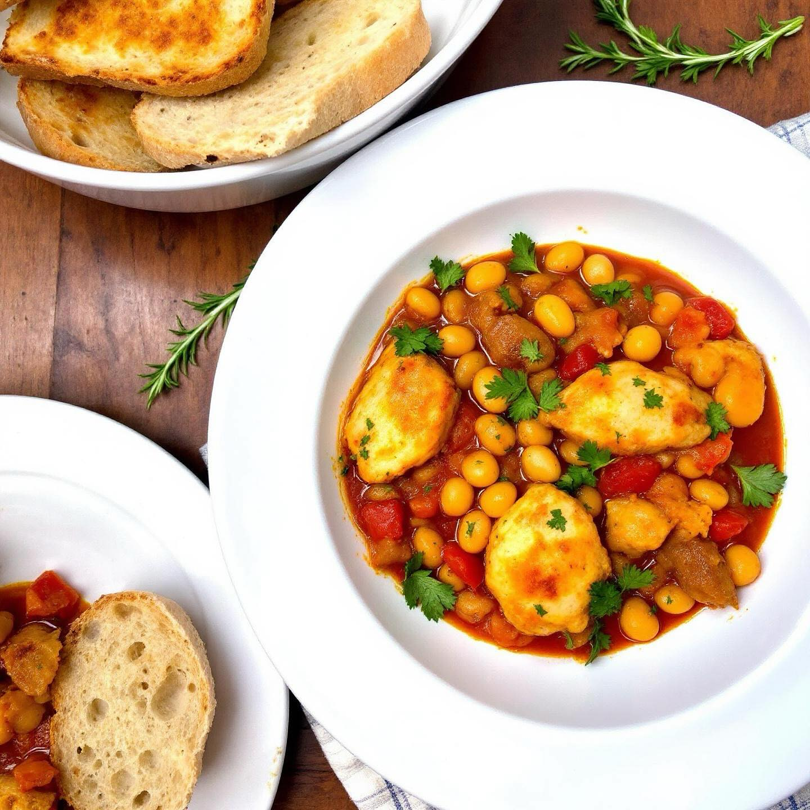

# ### Ingredienti: - 500 g di petto di pollo, tagliato a cubetti - 1 cipolla grand

### Ingredienti: - 500 g di petto di pollo, tagliato a cubetti - 1 cipolla grande, tritata - 2 spicchi d’aglio, tritati - 400 g di fagioli cannellini, scolati e risciacquati (o un altro tipo di fagioli a tua scelta) - 400 ml di salsa di pomodoro - 2 cucchiai di olio d’oliva - Sale e pepe q.b. - 1 cucchiaino di origano secco - 1 foglia di alloro - Peperoncino (facoltativo, a piacere) #### Preparazione: 1. **Preparare gli ingredienti:** Inizia tagliando il pollo a cubetti e tritando finemente la cipolla e l’aglio. 2. **Rosolare il pollo:** In una padella grande o in una pentola, scalda l’olio d’oliva a fuoco medio-alto. Aggiungi i cubetti di pollo e rosolali fino a quando non sono dorati su tutti i lati. Rimuovili dalla padella e mettili da parte. 3. **Cuocere cipolla e aglio:** Nella stessa padella, aggiungi la cipolla tritata e cuocila fino a quando diventa traslucida. Aggiungi l’aglio e cuoci per un altro minuto, facendo attenzione a non bruciarlo. 4. **Aggiungere salsa di pomodoro e fagioli:** Versa la salsa di pomodoro nella padella con la cipolla e l’aglio. Mescola bene, poi aggiungi i fagioli scolati e risciacquati. 5. **Unire il pollo e condire:** Riporta il pollo nella padella. Aggiungi l’origano, la foglia di alloro, sale, pepe e, se desideri, un pizzico di peperoncino. Mescola bene il tutto. 6. **Cuocere a fuoco lento:** Riduci il fuoco a medio-basso, copri la padella e lascia cuocere a fuoco lento per circa 20-25 minuti, mescolando di tanto in tanto, fino a quando il pollo è cotto e i sapori si sono ben amalgamati. 7. **Servire:** Rimuovi la foglia di alloro prima di servire. Il piatto è ottimo servito caldo, accompagnato da pane croccante o riso bianco.

---

*Ricetta da @leguminando*
