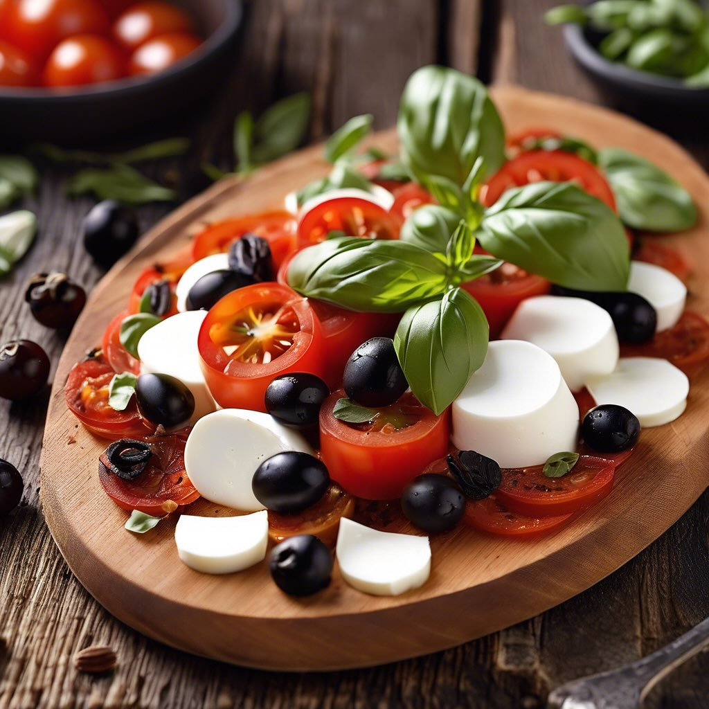

# ### Ingredienti: - Mozzarella di bufala - Pomodori freschi a fette - Pomodori se

### Ingredienti: - Mozzarella di bufala - Pomodori freschi a fette - Pomodori secchi - Olive nere a fette - Origano secco - Parmigiano a fette cotto alla griglia - Pane fatto con farina di lenticchie ### Preparazione del pane di lenticchie: 1. **Ingredienti per il pane**: - 250 g di farina di lenticchie - 200 ml di acqua - 1 cucchiaino di sale - 1 cucchiaio di olio d’oliva (opzionale) 2. **Preparazione**: - In una ciotola, unire la farina di lenticchie e il sale. Mescolare bene per distribuire uniformemente il sale nella farina. - Aggiungere lentamente l’acqua, mescolando con un cucchiaio di legno fino a ottenere un impasto omogeneo. Se desideri, aggiungi l’olio d’oliva per un sapore extra. - Impastare a mano per circa 5-7 minuti, fino a quando l’impasto non diventa morbido ed elastico. Se l’impasto risulta troppo appiccicoso, puoi aggiungere un po’ più di farina di lenticchie. - Formare una palla con l’impasto e coprirla con un canovaccio umido. Lasciar riposare per almeno 30 minuti a temperatura ambiente. - Preriscaldare il forno a 200°C. Su una teglia foderata con carta da forno, stendere l’impasto in una forma desiderata (pane, focaccia o panini). - Cuocere in forno per circa 25-30 minuti, fino a quando il pane non risulta dorato e cotto all’interno. Lascia raffreddare prima di affettare. ### Composizione dell’antipasto caprese: 1. Su un piatto da portata, disporre le fette di mozzarella di bufala alternandole con le fette di pomodoro fresco. 2. Aggiungere i pomodori secchi e le olive nere a fette, distribuendoli uniformemente. 3. Cospargere con un pizzico di origano secco per esaltare i sapori. 4. Grigliare le fette di Parmigiano fino a quando non diventano dorate e croccanti, quindi aggiungerle al piatto. 5. Servire il tutto accompagnato dalle fette di pane di lenticchie, che possono essere utilizzate per raccogliere gli altri ingredienti.

---

*Ricetta da @leguminando*
