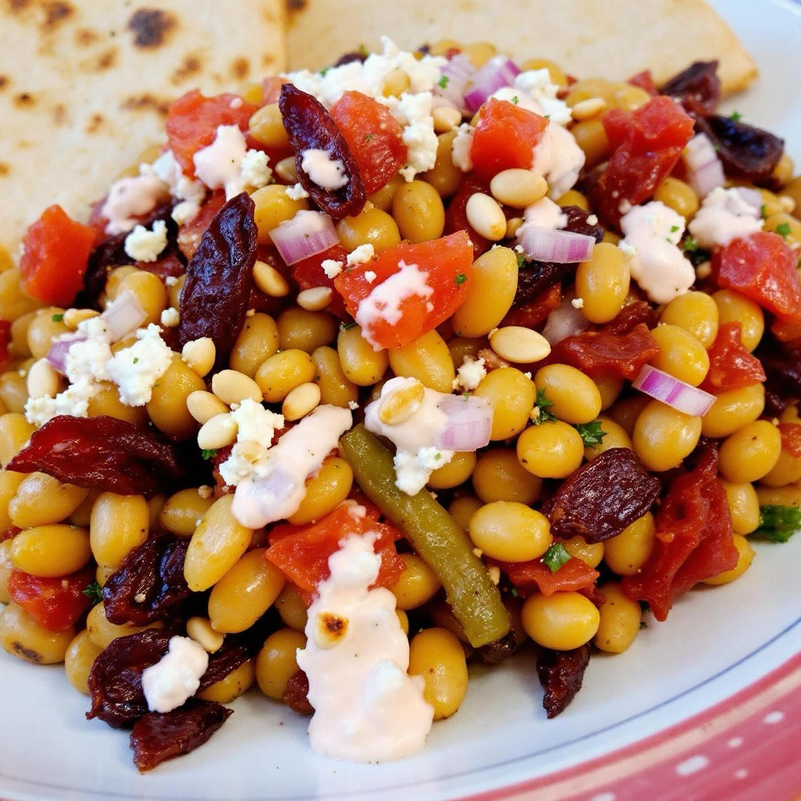

# ### Ingredienti - **Per i fagioli**: - 2 cucchiai di olio extravergine d’oliva -

### Ingredienti - **Per i fagioli**: - 2 cucchiai di olio extravergine d’oliva - 5 o 6 pomodori secchi tritati - 1 spicchio d’aglio tritato - 1 cipolla - Qualche rametto di origano fresco - 1 cucchiaino di peperoncino in fiocchi (a piacere) - 240 g di fagioli corona (cotti) - 1 cucchiaio di triplo concentrato di pomodoro - 25 ml di vermouth rosso o vino bianco secco - Pomodori pizzutello o camone (a piacere) - **Per la crema di feta**: - 200 g di feta - 2 cucchiai di olio extravergine d’oliva - 80 g di yogurt greco - 2 cucchiai di acqua - Pepe q.b. ### Preparazione 1. **Crema di feta**: Frulla la feta con olio, yogurt e acqua fino a ottenere una crema liscia. Aggiusta di pepe e metti da parte. 2. **Fagioli**: Se usi fagioli secchi, mettili a bagno e lessali. Se già cotti, scolali e sciacquali. 3. **Soffritto**: In una padella, scalda l’olio e soffriggi cipolla e aglio fino a doratura. 4. **Pomodori secchi**: Aggiungi i pomodori secchi e il peperoncino, mescolando per un paio di minuti. 5. **Fagioli e pomodoro**: Unisci i fagioli, il concentrato di pomodoro e sfuma con il vermouth. 6. **Pomodori freschi**: Aggiungi i pomodori freschi tagliati e l’origano, cuocendo per altri 5 minuti. 7. **Servire**: Distribuisci i fagioli nei piatti, guarnisci con la crema di feta, pinoli tostati e origano. Servi con pane pita o piadine grigliate.

---

*Ricetta da @leguminando*
