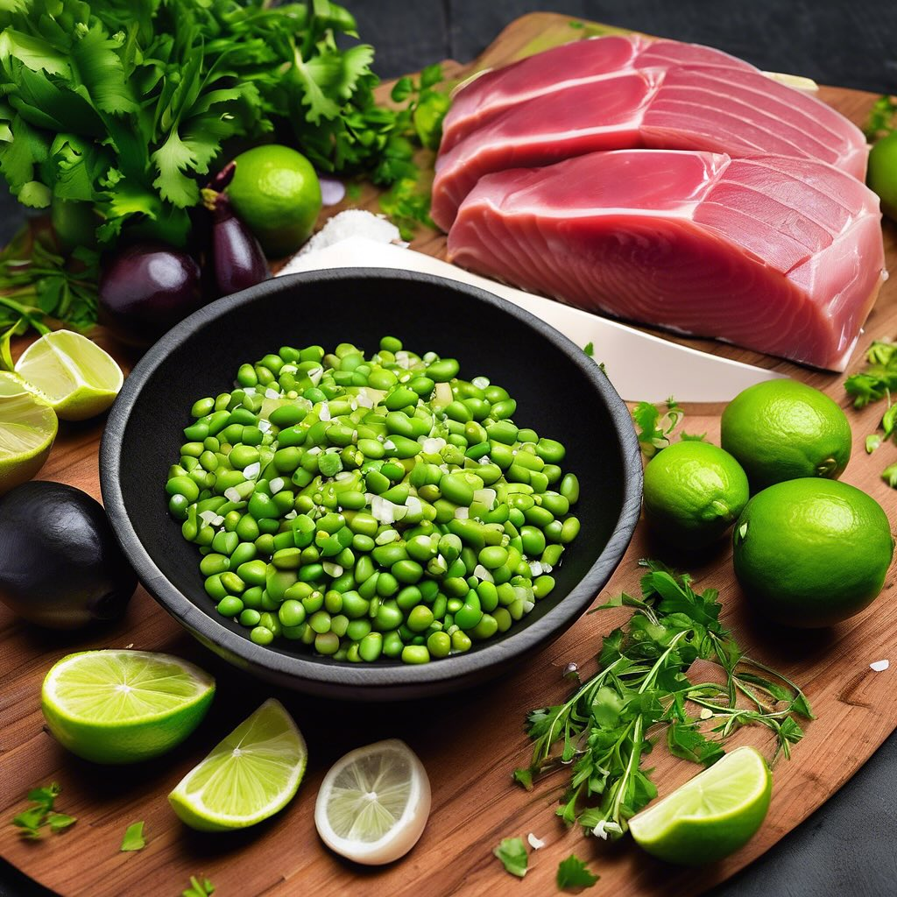

# # Ingredienti - **Per il pesce alla griglia:** - 300 g di totani - 300 g di polp

# Ingredienti - **Per il pesce alla griglia:** - 300 g di totani - 300 g di polpi - 300 g di gamberi - Olio d’oliva - Sale e pepe q.b. - Limone (per servire) - **Per la salsa:** - 100 ml di rum - 200 g di ceci (già cotti) - 1 cucchiaio di paprika dolce - Succo di 1 limone - Sale e pepe q.b. - **Per i peperoni:** - 2 peperoni rossi - 2 peperoni gialli - Olio d’oliva - Sale q.b. ### Preparazione 1. **Preparazione dei pesci:** - Pulire i totani e i polpi. Tagliare i totani a rondelle e lasciare i polpi interi. - Marinare il pesce con olio d’oliva, sale e pepe per almeno 30 minuti. 2. **Preparazione della salsa:** - In un frullatore, unire i ceci, il rum, la paprika, il succo di limone, sale e pepe. - Frullare fino ad ottenere una salsa liscia e omogenea. Se necessario, aggiungere un po’ d’acqua per raggiungere la consistenza desiderata. 3. **Grigliata dei pesci:** - Preriscaldare la griglia a fuoco medio-alto. - Grigliare i totani e i polpi per circa 3-4 minuti per lato, o fino a quando non sono cotti e leggermente carbonizzati. - Grigliare i gamberi per circa 2-3 minuti per lato, finché diventano rosa e opachi. 4. **Preparazione dei peperoni:** - Lavare i peperoni, tagliarli a metà e rimuovere i semi. Marinare con olio d’oliva e sale. - Grigliare i peperoni per circa 5-6 minuti, girandoli una volta, fino a quando sono teneri e leggermente abbrustoliti. 5. **Impiattamento:** - Disporre i totani, i polpi e i gamberi su un piatto da portata. Aggiungere i peperoni grigliati accanto al pesce. - Versare la salsa a base di rum e ceci sopra il pesce o servirla a parte in una ciotola.

---

*Ricetta da @leguminando*
