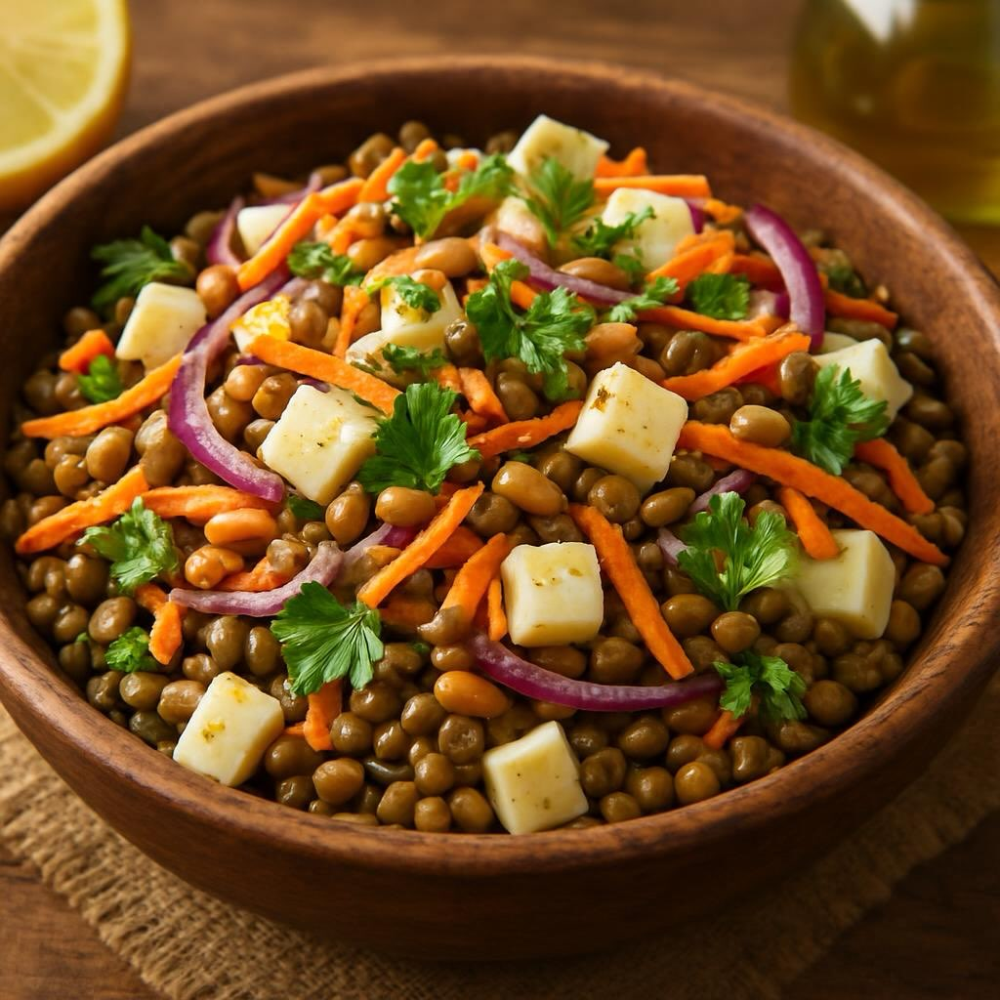

# #### Ingredienti - **Per l’insalata:** - 200 g di lenticchie (preferibilmente ve

#### Ingredienti - **Per l’insalata:** - 200 g di lenticchie (preferibilmente verdi o marroni) - 1 sedano rapa medio, pelato e tagliato a cubetti - 50 g di pinoli, tostati - 1 carota, grattugiata - 1/2 cipolla rossa, affettata finemente - 1 mazzetto di prezzemolo fresco, tritato - Sale e pepe q.b. - **Per il condimento:** - 4 cucchiai di olio extravergine d’oliva - 2 cucchiai di aceto di mele o di balsamico - 1 cucchiaino di senape di Digione (facoltativo) - Succo di 1 limone - Sale e pepe q.b. #### Preparazione 1. **Cuocere le lenticchie:** - Sciacqua le lenticchie sotto acqua corrente. Metti le lenticchie in una pentola con abbondante acqua e porta a ebollizione. Cuoci per circa 20-30 minuti, o fino a quando sono tenere. Scolale e falle raffreddare. 2. **Preparare il sedano rapa:** - Nel frattempo, lessa i cubetti di sedano rapa in acqua salata per circa 10-15 minuti finché non sono teneri, ma ancora croccanti. Scolali e lasciali raffreddare. 3. **Tostare i pinoli:** - In una padella asciutta, tosta i pinoli a fuoco medio fino a doratura, mescolando spesso per evitare che si brucino. Toglili dal fuoco e lasciali raffreddare. 4. **Preparare il condimento:** - In una ciotola, mescola l’olio d’oliva, l’aceto, la senape (se la usi), il succo di limone, sale e pepe. Emulsiona bene il tutto. 5. **Assemblare l’insalata:** - In una ciotola grande, unisci le lenticchie cotte, il sedano rapa, la carota grattugiata, la cipolla rossa e il prezzemolo. Aggiungi i pinoli tostati e mescola delicatamente. - Versa il condimento sull’insalata e mescola per amalgamare tutti gli ingredienti.

---

*Ricetta da @leguminando*
