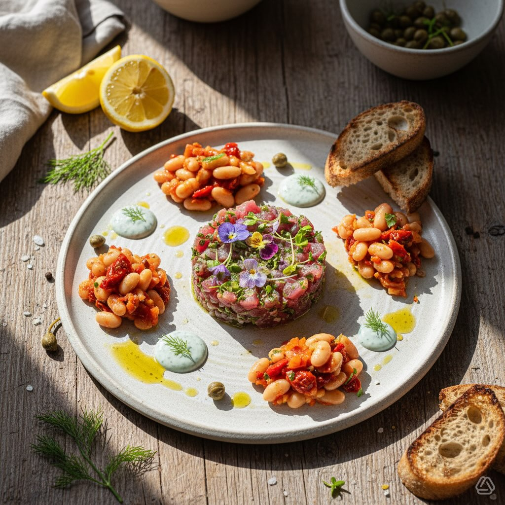

# Ingredienti - Pesce spada freschissimo: 300 g (filetto) - Fagioli cannellini pre

Ingredienti - Pesce spada freschissimo: 300 g (filetto) - Fagioli cannellini precotti: 150 g - Cipolla rossa di Tropea: 30 g - Cetriolo: 40 g - Capperi dissalati: 15 g - Succo di limone: 25 g (circa 1–2 cucchiai) - Olio extravergine d’oliva: 30 g - Scorza di limone grattugiata: 2 g - Sale: 2 g - Pepe nero macinato: 1 g Tempo - Preparazione: 20 minuti - Cottura: 0 minuti - Riposo/marinatura: 10 minuti - Tempo totale: 30 minuti Difficoltà: Bassa Procedimento 1. Mantieni il pesce molto freddo. Controlla che la polpa sia soda e di colore rosa intenso. 2. Con coltello molto affilato, taglia il filetto in cubetti regolari di circa 5 mm. 3. Affetta la cipolla molto sottile (quasi traslucida). Taglia il cetriolo a piccoli dadini, mantenendo la parte interna acquosa. 4. Metti i fagioli in una ciotola e schiacciali grossolanamente con una forchetta: devono restare granulosi, non in purea. 5. In una ciotola fredda unisci pesce, cipolla, cetriolo, fagioli e capperi tritati. 6. Aggiungi succo di limone, olio, scorza di limone, sale e pepe. Mescola delicatamente finché ogni cubetto è ricoperto dal condimento. 7. Copri e lascia riposare in frigorifero per 10 minuti prima di servire. Consigli pratici - Mantieni il pesce sempre molto freddo durante la preparazione. - Per aroma diverso sostituisci l’aneto con prezzemolo (5 g). - Per contrasto termico servi su un piatto freddo (es. ardesia dal congelatore). Avviso sicurezza alimentare (importante) - Piatto crudo: usa pesce acquistato da fornitore affidabile e mantienilo sempre refrigerato. - Soggetti a rischio (gravidanza, bambini, anziani, immunodepressi) devono evitare pesce crudo o consultare il medico. - Per ridurre il rischio di anisakis, considera la congelazione a −20 °C per almeno 24–48 ore o scottare brevemente i cubetti (10–20 s per lato); segui le normative locali. Valori nutrizionali stimati (totale ricetta per 2 persone — valori approssimativi) - Totale: 849 kcal — Proteine 75.6 g — Grassi 43.9 g — Carboidrati 41.3 g - Per porzione (1/2): 425 kcal — Proteine 37.8 g — Grassi 22.0 g — Carboidrati 20.6 g

---

*Ricetta da @leguminando*
