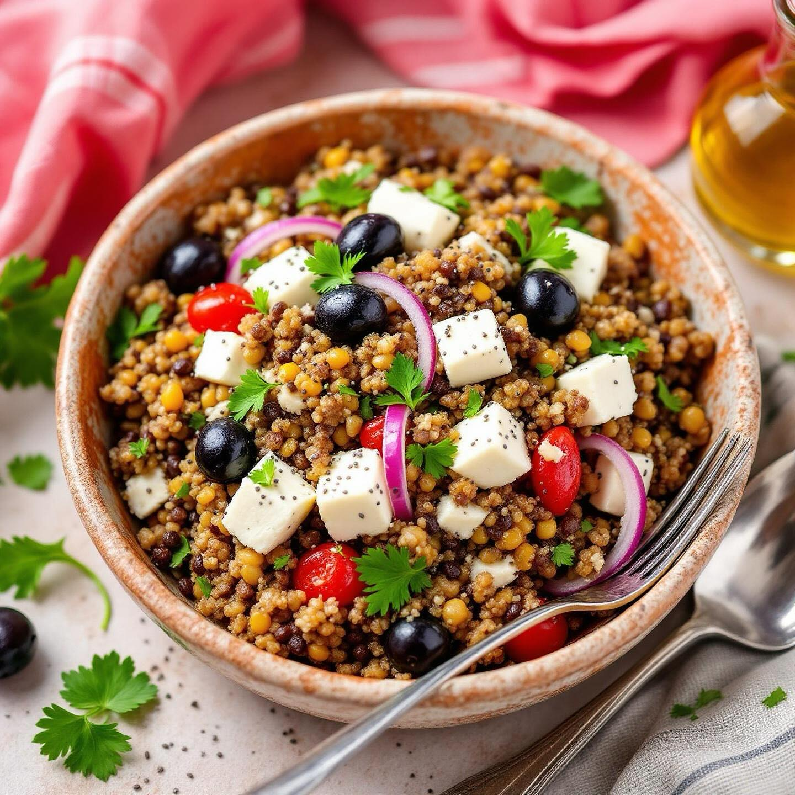

# ## Ingredienti **Per 4 persone:** - 200g di quinoa mista (bianca e rossa) - 150g

## Ingredienti **Per 4 persone:** - 200g di quinoa mista (bianca e rossa) - 150g di lenticchie rosse già cotte - 100g di feta greca a cubetti - 80g di olive nere denocciolate - 6-8 filetti di acciughe sott’olio - 1 cipolla rossa media - 2 cucchiai di semi di chia - 4 cucchiai di olio extravergine d’oliva - 2 cucchiai di aceto balsamico - Succo di 1 limone - Prezzemolo fresco - Sale e pepe nero ## Preparazione **Preparazione della quinoa** Sciacquate accuratamente la quinoa sotto l’acqua corrente fino a che l’acqua non risulti limpida[1]. Cuocetela in abbondante acqua salata per circa 15 minuti, scolatela e lasciatela raffreddare completamente. **Preparazione degli ingredienti** Tagliate la cipolla rossa a julienne sottile e lasciatela marinare in acqua ghiacciata per 10 minuti per attenuare il sapore piccante. Scolate le lenticchie se necessario e sciacquatele brevemente. Tagliate la feta a cubetti di circa 1,5 cm e spezzettate grossolanamente i filetti di acciughe. **Assemblaggio dell’insalata** In una ciotola capiente, unite la quinoa fredda con le lenticchie, aggiungete la cipolla scolata e asciugata, la feta, le olive tagliate a metà e le acciughe spezzettate. Cospargete con i semi di chia che aggiungeranno una piacevole croccantezza al piatto. **Condimento finale** Preparate una vinaigrette emulsionando l’olio extravergine con l’aceto balsamico e il succo di limone. Condite l’insalata, mescolate delicatamente per non rompere la feta e aggiustate di sale e pepe. Lasciate riposare in frigorifero per almeno 30 minuti prima di servire. Servite guarnendo con prezzemolo fresco tritato. Questo piatto si conserva in frigorifero per 2-3 giorni ed è perfetto da portare al mare o in ufficio come pasto completo e nutriente. #leguminando

---

*Ricetta da @leguminando*
