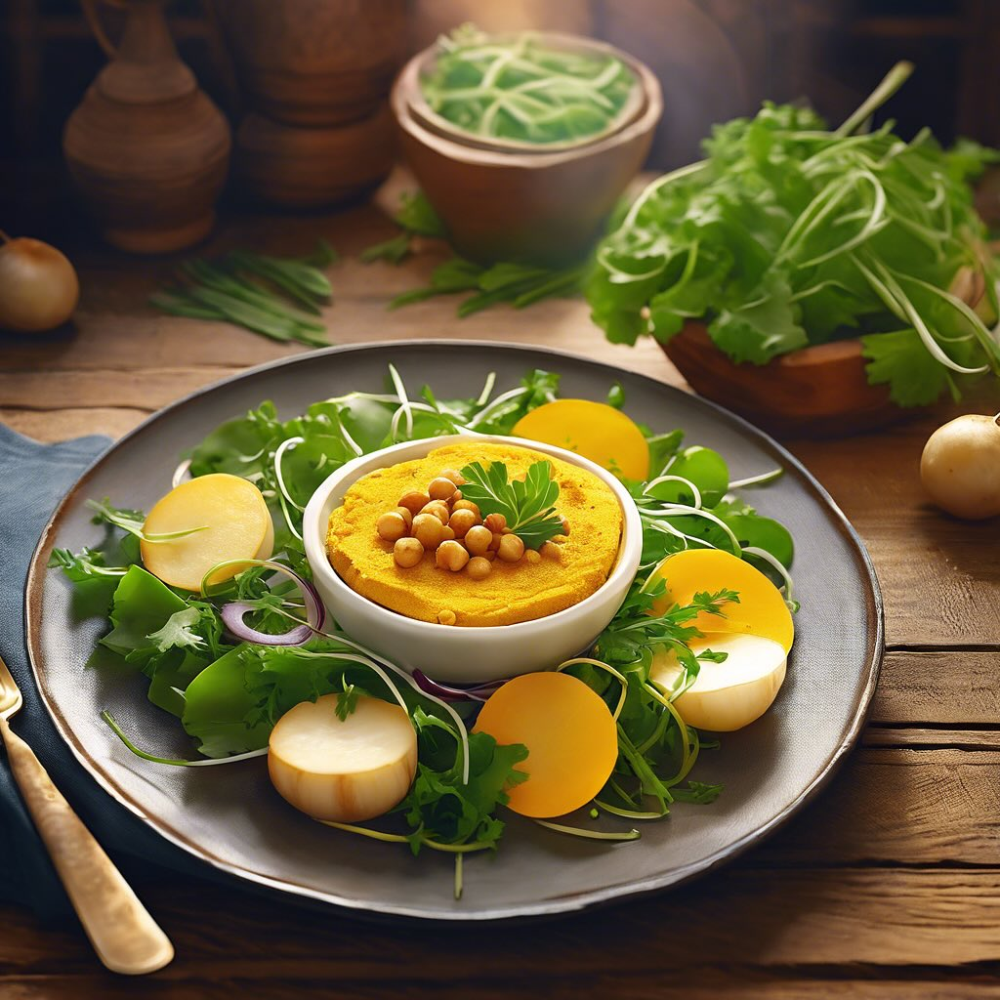

# ### Ingredienti **Per i medaglioni:** - 300 g di rape bianche (già cotte e pelat

### Ingredienti **Per i medaglioni:** - 300 g di rape bianche (già cotte e pelate) - 150 g di farina di ceci - 1 pizzico di zafferano - 1 cipolla piccola, tritata finemente - 1 spicchio d’aglio, tritato - 1 cucchiaio di olio d’oliva - Sale e pepe q.b. - Prezzemolo fresco tritato (opzionale) **Per servire:** - Foglie di insalata o verdure a piacere ### Procedimento 1. **Preparare i medaglioni:** - Mettere lo zafferano in una ciotola con un cucchiaio d’acqua calda per farlo sciogliere. - In una padella, scaldare l’olio d’oliva e soffriggere la cipolla e l’aglio fino a doratura. - In una ciotola, schiacciare le rape bianche cotte con una forchetta fino a ottenere una purea. - Aggiungere la farina di ceci, il composto di zafferano, la cipolla e l’aglio soffritti, sale, pepe e prezzemolo (se desiderato). Mescolare bene fino a ottenere un composto omogeneo. - Formare dei medaglioni della dimensione desiderata con le mani. 2. **Cuocere:** - Scaldare un po’ d’olio in una padella antiaderente e cuocere i medaglioni per circa 4-5 minuti per lato, fino a quando non sono dorati. 3. **Impiattare:** - Servire i medaglioni caldi su un letto di foglie di insalata o con verdure a piacere.

---

*Ricetta da @leguminando*
