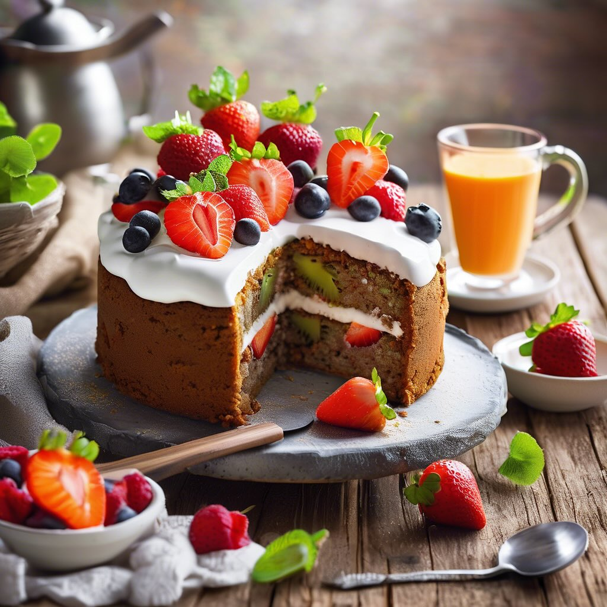

# ### Ingredienti #### Per l’antipasto: - 200 g di agretti - 200 g di asparagi - 4

### Ingredienti #### Per l’antipasto: - 200 g di agretti - 200 g di asparagi - 4 uova - 4 fette di pane casereccio - 100 g di crema di olive - 200 g di pomodori (preferibilmente pomodorini) - 200 g di ceci in scatola (già cotti) - 100 g di sarde sott’olio - 200 g di hummus di ceci (puoi comprarlo o prepararlo in casa) ### Procedimento 1. **Preparazione delle uova sode:** - Mettere le uova in un pentolino con acqua fredda e portare a ebollizione. Cuocere per 9-10 minuti. Dopo la cottura, raffreddarle in acqua fredda, sbucciarle e tagliarle a metà. 2. **Cottura degli agretti e degli asparagi:** - Pulire gli agretti e sciacquarli. In una pentola, portare acqua salata a ebollizione e sbollentare gli agretti per circa 3-4 minuti. Scolarli e passarli sotto acqua fredda per fermare la cottura. - Pulire gli asparagi, eliminando la parte legnosa. Sbollentarli in acqua salata per 3-4 minuti e poi raffreddarli in acqua e ghiaccio. 3. **Preparazione delle bruschette:** - Tostare le fette di pane in forno o su una griglia fino a doratura. - Per le bruschette alla crema di olive, spalmare la crema di olive su due fette di pane. - Per le bruschette al pomodoro, tagliare i pomodori a cubetti, condirli con olio d’oliva, sale e pepe e distribuirli sulle altre due fette di pane. 4. **Preparazione dei ceci con sarde:** - Scolare i ceci e metterli in una ciotola. Aggiungere le sarde sott’olio, schiacciando leggermente le sarde con una forchetta per amalgamarle ai ceci. Aggiustare di sale e pepe. 5. **Impiattamento:** - Su un grande piatto da portata, disporre gli agretti e gli asparagi in modo armonioso. - Aggiungere le uova sode tagliate a metà. - Sistemare le bruschette alla crema di olive e al pomodoro. - Aggiungere un cucchiaio di ceci con sarde e un cucchiaio di hummus di ceci in diversi angoli del piatto.

---

*Ricetta da @leguminando*
