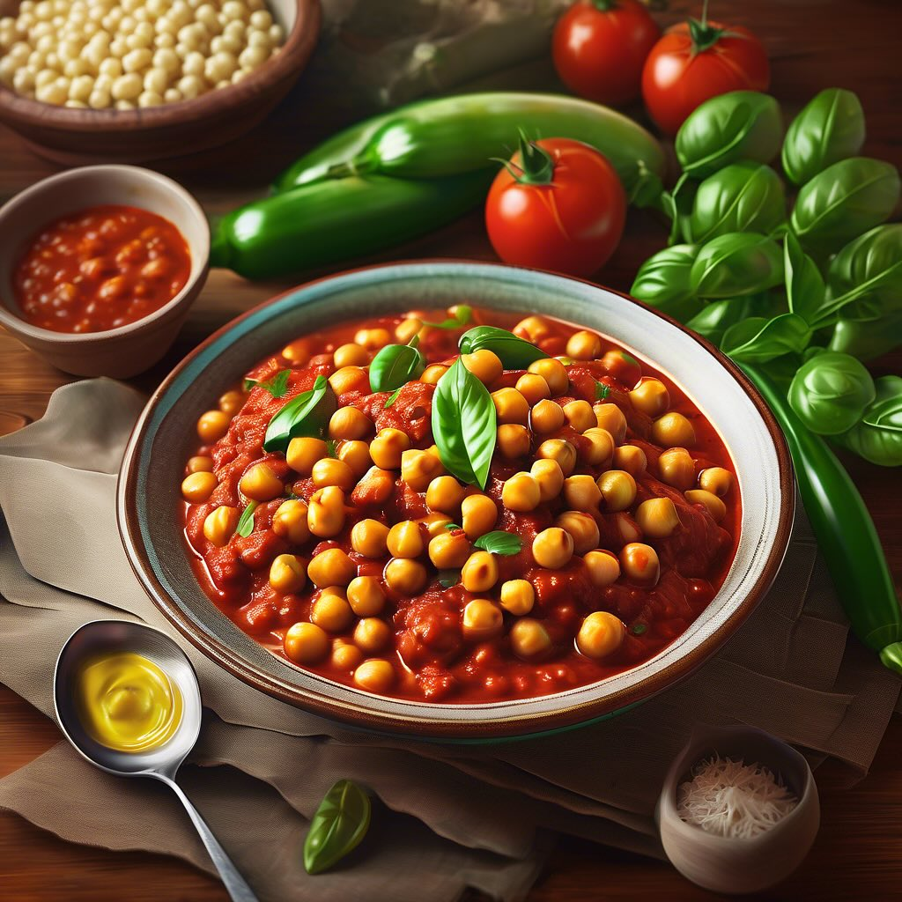

# ### Ingredienti #### Per le polpette: - 400 g di ceci cotti (in scatola o lessat

### Ingredienti #### Per le polpette: - 400 g di ceci cotti (in scatola o lessati) - 1 zucchina media, grattugiata - 1/2 cipolla, tritata finemente - 1 spicchio d’aglio, tritato - 50 g di pangrattato - 1 uovo - Prezzemolo fresco tritato (a piacere) - Sale e pepe q.b. - Olio d’oliva q.b. #### Per il sugo: - 1 cipolla grande, affettata - 400 g di pomodori pelati (o passata di pomodoro) - 1 carota, grattugiata (opzionale) - Basilico fresco (a piacere) - Sale e pepe q.b. - Olio d’oliva q.b. ### Procedimento 1. **Preparare le polpette:** - In una ciotola, schiaccia i ceci con una forchetta o un frullatore fino a ottenere una consistenza grossolana. - Aggiungi la zucchina grattugiata, la cipolla tritata, l’aglio, il pangrattato, l’uovo, il prezzemolo, il sale e il pepe. Mescola bene fino a ottenere un composto omogeneo. - Forma delle polpette delle dimensioni di una noce e mettile da parte. 2. **Preparare il sugo:** - In una casseruola, scalda un filo d’olio d’oliva e aggiungi la cipolla affettata. Fai soffriggere fino a quando diventa trasparente. - Se usi la carota, aggiungila e fai rosolare per qualche minuto. - Aggiungi i pomodori pelati (o la passata di pomodoro), il sale e il pepe. Cuoci a fuoco medio per circa 10-15 minuti, mescolando di tanto in tanto. 3. **Cuocere le polpette:** - Una volta che il sugo è pronto, aggiungi delicatamente le polpette al sugo. Copri e lascia cuocere a fuoco lento per circa 20-25 minuti, fino a quando le polpette sono cotte e saporite. - Aggiungi basilico fresco a piacere. 4. **Servire:** - Servi le polpette di ceci e zucchine in umido calde, accompagnate da un contorno di riso, pane o una fresca insalata.

---

*Ricetta da @leguminando*
