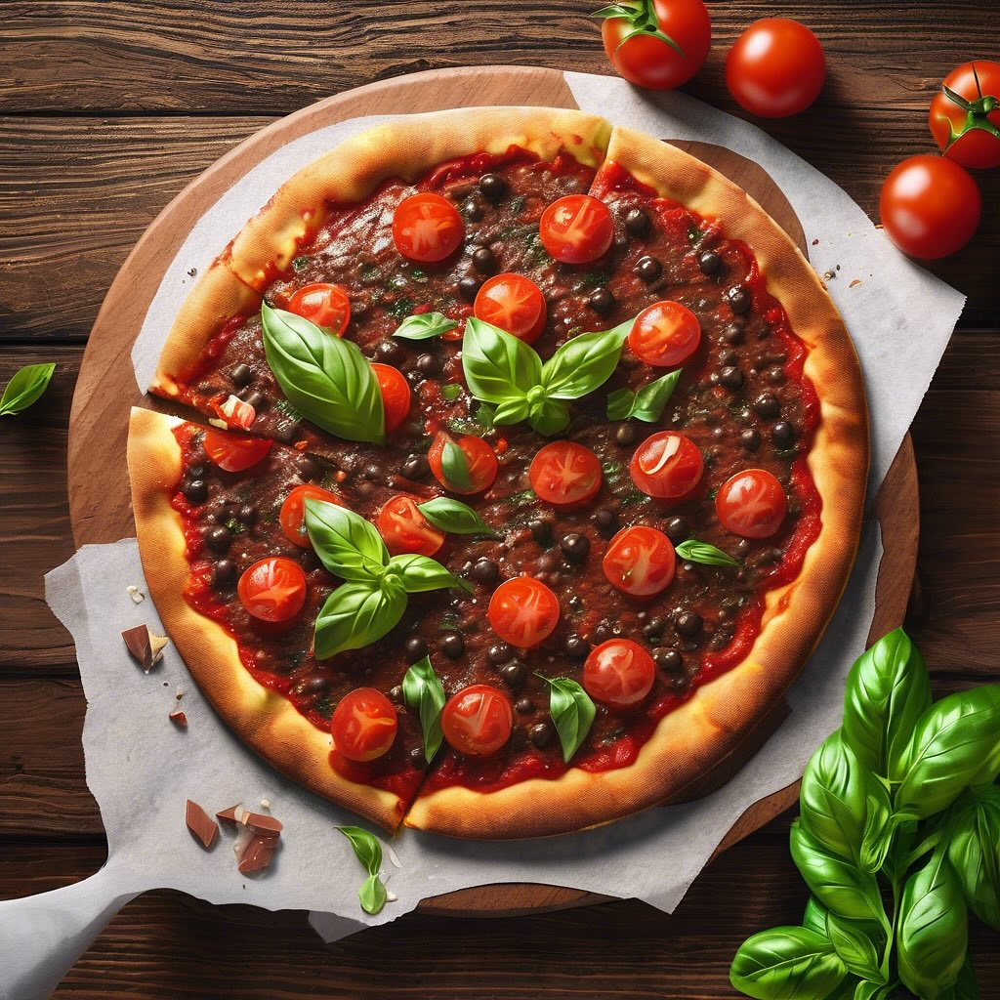

# ### Ingredienti #### Per l’impasto: - 250 g di farina di carrube - 150 ml di acq

### Ingredienti #### Per l’impasto: - 250 g di farina di carrube - 150 ml di acqua tiepida - 5 g di lievito di birra secco - 1 cucchiaino di zucchero - 1 cucchiaino di sale - 2 cucchiai di olio extravergine d’oliva #### Per la farcitura: - 200 g di pomodoro passato - 2 cucchiai di concentrato di pomodoro - 1 spicchio d’aglio (facoltativo) - Sale e pepe q.b. - Origano secco q.b. - Mozzarella (o alternativa vegana) a piacere - Basilico fresco per guarnire ### Istruzioni #### Preparazione dell’impasto: 1. In una ciotola, sciogliere il lievito di birra secco e lo zucchero nell’acqua tiepida. Lascia riposare per circa 10 minuti, finché non si forma una schiuma. 2. In un’altra ciotola, mescolare la farina di carrube e il sale. 3. Aggiungere il mix di lievito e olio alla farina e impastare fino a ottenere un composto liscio e omogeneo. Se l’impasto risulta troppo appiccicoso, aggiungere un po’ di farina. 4. Formare una palla e lasciarla lievitare in un luogo caldo per circa 1 ora, coperta con un canovaccio. #### Preparazione della salsa: 1. In una padella, scaldare un filo d’olio e, se desiderato, soffriggere lo spicchio d’aglio tritato per qualche minuto. 2. Aggiungere il pomodoro passato e il concentrato di pomodoro. Mescolare bene e cuocere a fuoco medio per circa 10-15 minuti, fino a quando la salsa si addensa. Aggiungere sale, pepe e origano a piacere. #### Assemblaggio della pizza: 1. Preriscaldare il forno a 220°C. 2. Stendere l’impasto lievitato su una teglia foderata con carta da forno, formando un disco. 3. Distribuire uniformemente la salsa di pomodoro sulla base. 4. Aggiungere la mozzarella a pezzetti sopra la salsa. 5. Infornare per 15-20 minuti, fino a quando la pizza è dorata e croccante. #### Servizio: 1. Sfornare la pizza e guarnire con basilico fresco. 2. Lasciare raffreddare leggermente prima di tagliare e servire.

---

*Ricetta da @leguminando*
