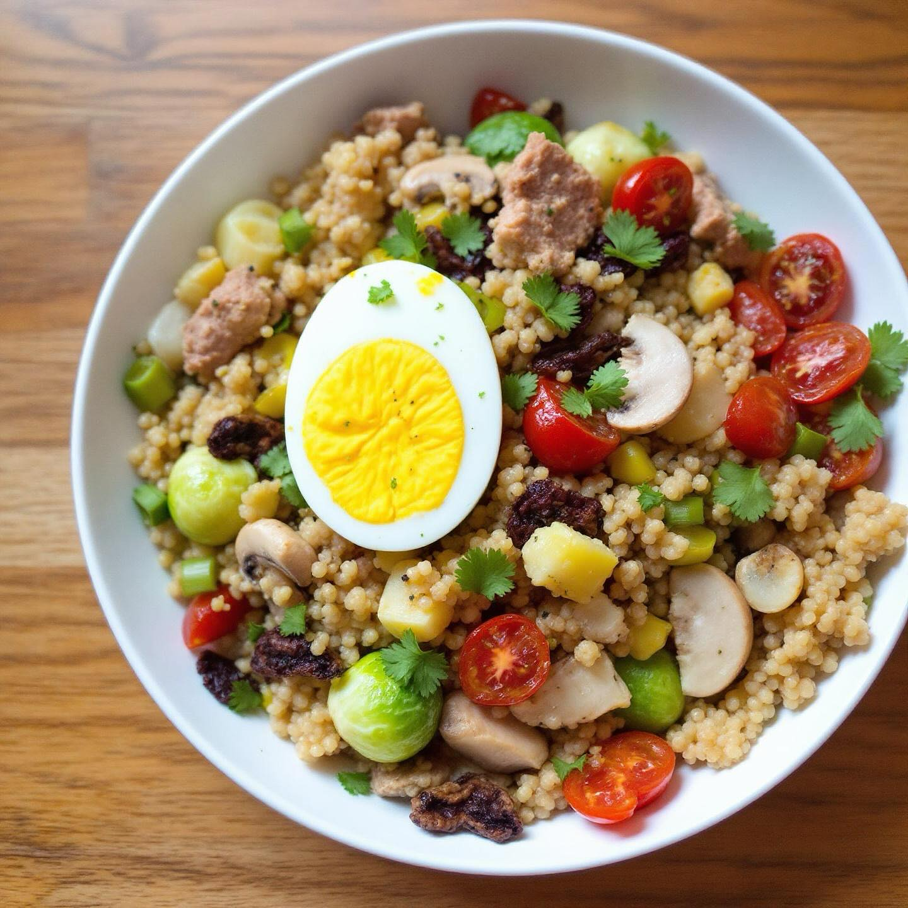

# ### Insalata Estiva di Quinoa con Tonno e Uova Sode #### Ingredienti: - 200g di 

### Insalata Estiva di Quinoa con Tonno e Uova Sode #### Ingredienti: - 200g di quinoa - 2 uova - 1 scatoletta di tonno (circa 150g) - 2 porri - 2 spicchi d’aglio - 5 pomodori secchi sott’olio - 150g di funghi (champignon o altri a piacere) - 200g di cavoletti di Bruxelles - Olio extravergine di oliva - Sale e pepe q.b. - Succo di limone (facoltativo) #### Preparazione: 1. **Cottura della quinoa**: Sciacqua la quinoa sotto acqua corrente. In una pentola, porta a ebollizione 400 ml di acqua, aggiungi la quinoa e un pizzico di sale. Copri e cuoci a fuoco basso per circa 15 minuti, finché l’acqua è assorbita. Togli dal fuoco e lascia raffreddare. 2. **Cottura delle uova**: In un pentolino, fai bollire dell’acqua. Aggiungi le uova e cuocile per circa 9-10 minuti per ottenere uova sode. Una volta cotte, raffreddale sotto acqua fredda, quindi sbucciale e tagliale a spicchi. 3. **Preparazione delle verdure**: Lava e affetta i porri e gli spicchi d’aglio. Pulisci i funghi e tagliali a fette. Taglia i pomodori secchi a pezzetti e i cavoletti di Bruxelles a metà. 4. **Saltare le verdure**: In una padella, scalda un filo d’olio extravergine d’oliva. Aggiungi i porri e l’aglio, e fai soffriggere per 3-4 minuti finché sono teneri. Aggiungi i funghi e i cavoletti di Bruxelles e continua a cuocere per circa 5-7 minuti, fino a quando le verdure sono cotte ma ancora croccanti. Aggiusta di sale e pepe. 5. **Assemblaggio dell’insalata**: In una ciotola grande, unisci la quinoa cotta, il tonno sgocciolato, le verdure saltate, i pomodori secchi e le uova sode tagliate. Mescola bene per amalgamare tutti gli ingredienti. 6. **Condimento**: Aggiungi un filo d’olio extravergine d’oliva e, se desideri, un po’ di succo di limone per freschezza. Mescola nuovamente e servi.

---

*Ricetta da @leguminando*
