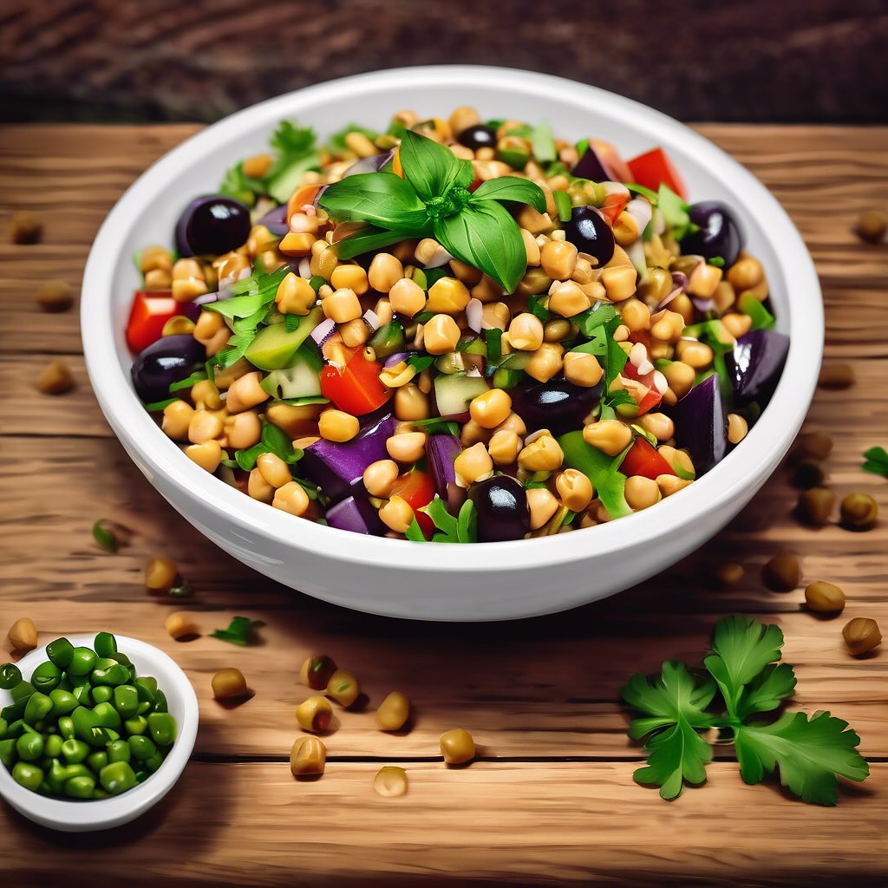

# ### Insalata Fredda di Ceci, Farro, Olive e Melanzane #### Ingredienti: - 200 g 

### Insalata Fredda di Ceci, Farro, Olive e Melanzane #### Ingredienti: - 200 g di ceci cotti (in scatola o lessati) - 150 g di farro - 100 g di olive nere e verdi - 1 melanzana grande - 1 cipolla rossa piccola - 2 cucchiai di olio d’oliva - Succo di limone q.b. - Sale e pepe q.b. - Prezzemolo fresco per guarnire #### Preparazione: 1. **Cottura del Farro**: In una pentola, porta a ebollizione dell’acqua salata. Aggiungi il farro e cuoci secondo le istruzioni sulla confezione (di solito circa 20 minuti). Una volta cotto, scolalo e lascialo raffreddare. 2. **Preparazione della Melanzana**: Lava e taglia la melanzana a cubetti. Scalda un filo d’olio d’oliva in una padella antiaderente e aggiungi i cubetti di melanzana. Cuoci fino a quando non sono dorati e teneri. Aggiungi un pizzico di sale e pepe. Lascia raffreddare. 3. **Preparazione degli Altri Ingredienti**: Nel frattempo, scola e risciacqua i ceci. Taglia le olive a rondelle e trita finemente la cipolla rossa. 4. **Assemblaggio dell’Insalata**: In una ciotola capiente, unisci il farro raffreddato, i ceci, le melanzane, le olive e la cipolla. Condisci con olio d’oliva, succo di limone, sale e pepe a piacere. Mescola bene per amalgamare tutti gli ingredienti. 5. **Servizio**: Trasferisci l’insalata in un piatto da portata e guarnisci con prezzemolo fresco tritato. Servi l’insalata fredda o a temperatura ambiente.

---

*Ricetta da @leguminando*
