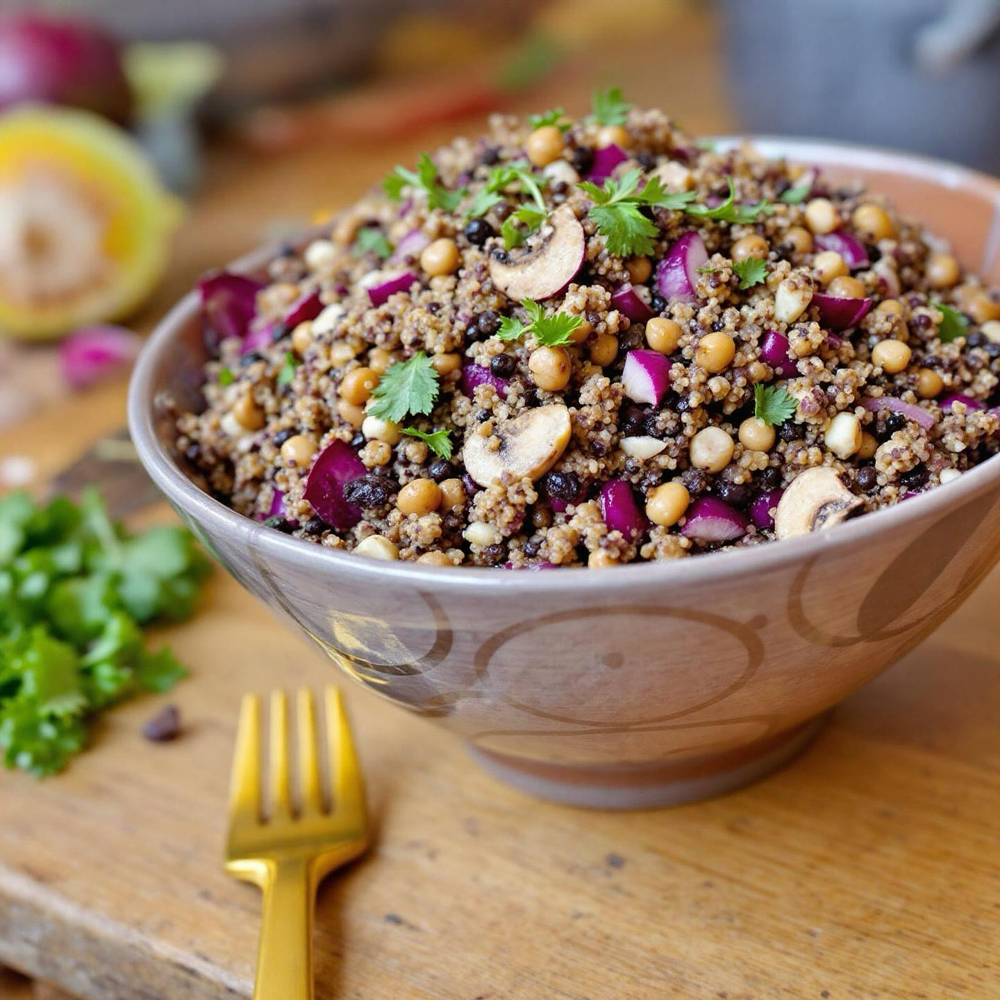

# ### Insalata Fredda di Quinoa e Lenticchie con Porcini e Radicchio #### Ingredie

### Insalata Fredda di Quinoa e Lenticchie con Porcini e Radicchio #### Ingredienti: - 100 g di quinoa - 100 g di lenticchie (preferibilmente verdi o marroni) - 150 g di funghi porcini freschi (o surgelati) - 1 cipolla rossa piccola - 2 spicchi d’aglio - 1 cespo di radicchio rosso - Olio extravergine d’oliva - Aceto balsamico - Sale e pepe q.b. - Prezzemolo fresco tritato (facoltativo, per guarnire) #### Procedimento: 1. **Cottura della Quinoa e delle Lenticchie:** - Sciacqua la quinoa sotto acqua corrente. Cuoci la quinoa in acqua bollente salata per circa 12-15 minuti. Scola e lascia raffreddare. - Cuoci le lenticchie in acqua bollente salata per circa 20-25 minuti, o finché non diventano tenere. Scola e lascia raffreddare. 2. **Preparazione dei Funghi Porcini:** - Pulisci i porcini con un panno umido e tagliali a fette. In una padella, scalda un filo d’olio e aggiungi uno spicchio d’aglio schiacciato. Fai rosolare i funghi per circa 5-7 minuti, fino a quando sono teneri. Aggiusta di sale e pepe e lascia raffreddare. 3. **Preparazione degli Ingredienti Freschi:** - Affetta finemente la cipolla rossa e trita l’aglio rimanente. Lava e taglia il radicchio a striscioline. 4. **Assemblaggio:** - In una grande ciotola, unisci la quinoa, le lenticchie, i funghi porcini, la cipolla rossa e il radicchio. Condisci con olio extravergine d’oliva, aceto balsamico, sale e pepe a piacere. Mescola bene. 5. **Servizio:** - Lascia riposare in frigorifero per almeno 30 minuti prima di servire, in modo che i sapori si amalgamino. Servi l’insalata fredda, eventualmente guarnita con prezzemolo fresco.

---

*Ricetta da @leguminando*
