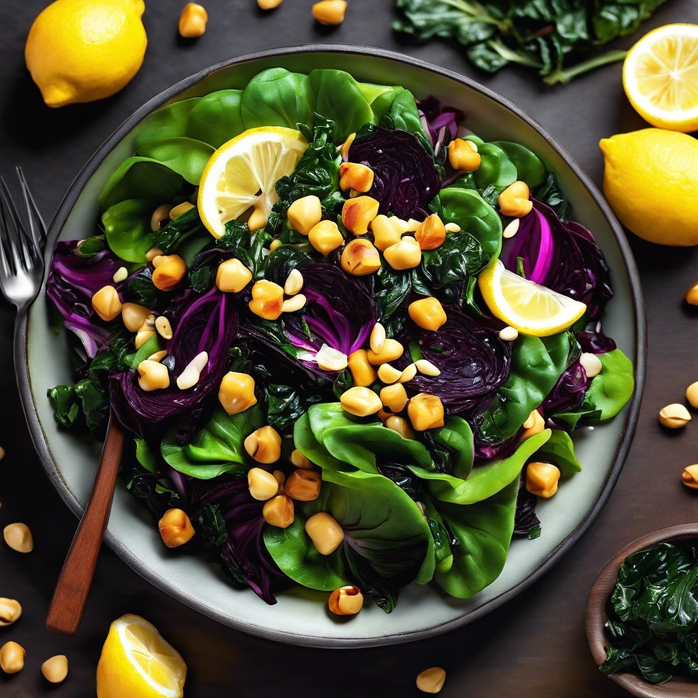

# **Insalata di Cavolo Nero e Ceci** - Ingredienti: cavolo nero, ceci lessati, pin

**Insalata di Cavolo Nero e Ceci** - Ingredienti: cavolo nero, ceci lessati, pinoli tostati, olio d’oliva, limone, sale e pepe. - Preparazione: mescolare il cavolo nero tagliato a strisce con i ceci, aggiungere pinoli tostati e condire con olio, limone, sale e pepe. **Preparazione**: Tagliare il cavolo nero a strisce sottili. In una ciotola grande, unire i ceci lessati e il cavolo. Tostare i pinoli in una padella senza olio fino a doratura. Aggiungere i pinoli all’insalata. Condire con olio d’oliva, succo di limone, sale e pepe. Mescolare bene e servire.

---

*Ricetta da @leguminando*
